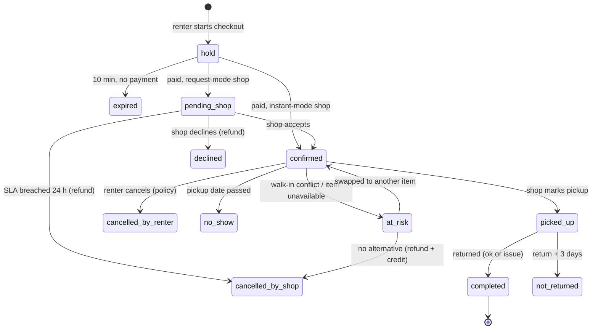
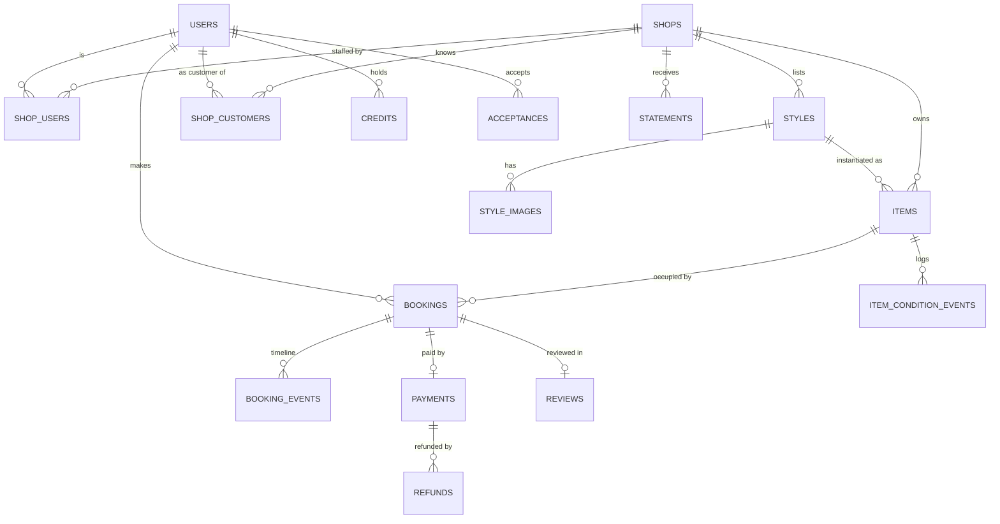

# Twirl — Requirements Specification

**Version** 0.1 (discovery draft) · **Date** 29 August 2026 · **Scope** dress rental marketplace, Kosovo · **Status** for founder review

**Contents:** [0 Honest read](#0-honest-read-on-the-concept) · [0.1 Questions & assumptions](#01-clarifying-questions--and-the-assumption-i-am-proceeding-on-for-each) · [0.2 Build approach](#02-build-approach-follows-from-q2) · [1 Business model](#1-business-model-and-unit-economics) · [2 Personas](#2-personas) · [3 Journeys](#3-end-to-end-journeys-including-unhappy-paths) · [4 Functional requirements](#4-functional-requirements-per-persona) · [5 Booking engine](#5-availability-and-booking-engine) · [6 Payments](#6-payments-and-money-flow) · [7 Trust & safety](#7-trust-and-safety) · [8 Non-functional](#8-non-functional-requirements) · [9 Data model](#9-data-model) · [10 Integrations](#10-integrations) · [11 Onboarding](#11-shop-onboarding-and-migration--the-wedge) · [12 Analytics](#12-analytics-and-reporting) · [13 Phasing](#13-scope-phasing) · [14 GTM](#14-go-to-market-mechanics-the-product-must-support) · [15 Open questions](#15-open-questions-and-decisions-you-need-to-make) · [16 Risks](#16-key-risks-and-mitigations) · [Appendices](#appendix-a--kosovo-verification-checklist-all--verify-ks-items-in-one-place)

**How to read this document**

- Every requirement is a table row: `ID | Persona | User story | Acceptance criteria | Priority (MoSCoW) | Phase`. Phases: **P0** = before any code (manual, no-code), **MVP** = first release, **P2**, **P3**.
- `⚠ ASSUMPTION` marks a guess you must verify before relying on it. `⚠ VERIFY-KS` marks a point of Kosovo law, tax, banking or logistics that I am not certain about — check it with an accountant, your bank, or a lawyer before building on it.
- Where I disagree with a working assumption in your brief, the paragraph starts with **Pushback**.
- The document is written to be handed to a contractor as-is, or fed to a coding agent section by section.

---

## 0. Honest read on the concept

The idea is sound, but the pitch is inverted. A marketplace has nothing to sell a shop on day one — no demand, no brand, one person — and the shop's current system (Instagram DMs, a phone, a paper agenda) is free, familiar, and already where its customers are. What shops plausibly *do* suffer from is the operational mess around that system: answering "a është e lirë më 19 korrik, masa 38?" fifty times a day, double-booking a dress in July, no-shows on a dress they turned three other customers away for, and losing control of the calendar during the six weeks when they make most of their year. So Twirl should be built and sold as **a booking calendar and storefront for dress rental shops that also brings them customers** — a tool worth using with zero Twirl-sourced demand, with the marketplace as the upside that arrives once several shops in one city keep their calendars true. Build the marketplace first and the calendar will lie within a week (walk-ins won't be entered), instant booking will produce conflicts, shops will churn, and you will have built a directory. The unit economics are honest but thin: at Kosovo price points a one-city, eight-shop version of this does not pay you a salary; it is a proof that the calendar can become the shop's system of record, which is the only thing that makes a multi-city, subscription-plus-commission business possible later. The single most important thing to do before writing code is to sit in 8–10 shops — ideally now, while the summer peak is fresh in their memory — and confirm that this pain exists and that they will enter walk-in bookings into something that isn't their notebook. The four TBDs at the bottom of your brief matter less than that one fact.

---

## 0.1 Clarifying questions — and the assumption I am proceeding on for each

None of these blocks the spec, so I have not stopped for them. Each row says what changes if the assumption is wrong.

| # | Question | Assumption used in this document | If wrong, what changes |
|---|---|---|---|
| Q1 | How many shop owners have you spoken to, and what did they say hurts most? | **Zero.** Stage is "idea only". I assume the pain ranking is (1) availability questions in DMs, (2) double bookings and no-shows in peak, (3) staff time. ⚠ ASSUMPTION | If shops name a different pain (e.g. stock financing, cleaning logistics, price competition), §1, §11 and §14 change and the wedge may not be a calendar at all. |
| Q2 | Can you write code yourself? | **Yes.** Evidence: this brief is being run from a PyCharm project directory inside a coding agent. | If no: §0.2 gives the no-code/contractor route; §5, §8, §9 become contractor instructions, and the MVP shrinks to request-and-confirm with no payment. |
| Q3 | Cash budget for the first six months? | **≤ €3,000** cash (registration, accountant, gateway fees, hosting, photo kit, small Instagram ad tests) plus your evenings and weekends. ⚠ ASSUMPTION | With €10k+: pay a photographer for the first 5 shops, start ads at launch, and pay a student for peak-season onboarding help. Nothing in the architecture changes. |
| Q4 | Do you have a registered business and a bank e-commerce merchant account, or can you get both within ~8 weeks? | **Not yet.** The bank application is the critical path and starts immediately. ⚠ VERIFY-KS on timeline | If the gateway takes > 3 months or is refused, MVP launches as **Phase 1a** (reservation without online payment; see §6.3) and the money model falls back to a shop-paid monthly invoice. |
| Q5 | Ferizaj or Pristina? | **Ferizaj pilot** (5–8 shops within 15 minutes of you), Pristina in season 2. | If Ferizaj has fewer than 6 rental shops or they refuse to post prices, start in Pristina and accept longer drives. |
| Q6 | Can you give ≥ 10 hours/week including in-person shop visits through the first season? | **Yes.** | If not, cap the pilot at 3 shops and skip instant booking entirely. |
| Q7 | Definition of success at 12 months? | **Proposed in §15.2** — you should edit it. | Changes the kill criteria and what gets cut from MVP. |
| Q8 | Do shops already take a deposit or hold an ID card at pickup, and do their customers use WhatsApp or Viber? | **Yes to both; both apps in use, Viber slightly more among older owners.** ⚠ ASSUMPTION | Affects §6 (what the shop collects in store), §7 (who handles damage) and §10 (which messaging channel to build first). |

---

## 0.2 Build approach (follows from Q2)

**Recommended stack if you build it yourself:** FastAPI + PostgreSQL 16 + server-rendered Jinja2 templates with HTMX and a little Alpine.js + Tailwind (founder's choice, 2026-09-25, replacing Django). Data layer: SQLAlchemy 2 + Alembic migrations. Auth: Starlette signed-cookie sessions with argon2 password hashing (fastapi-users was dropped because it requires async SQLAlchemy). Admin console at MVP: sqladmin on the same SQLAlchemy models, plus a few custom HTMX pages for the refund queue and view-as. Trade-off accepted: FastAPI has no built-in admin, auth, forms, or CSRF, so budget roughly one to two extra weeks to assemble them; keep it server-rendered and do not drift into a separate SPA. PostgreSQL is non-negotiable because the booking engine (§5) relies on range exclusion constraints. Host on a single Hetzner VPS (Nuremberg/Falkenstein, ~35 ms to Kosovo) behind Cloudflare (DNS, CDN, WAF, R2 for images), with nightly `pg_dump` to object storage and a tested restore. Add a PWA manifest so the shop's phone can pin the calendar to the home screen; do not build a native app.

Avoid: a separate SPA + API (doubles the work for one person), serverless (solves a scale problem you do not have), a NoSQL store (no range constraints), and any framework you have not shipped with before.

**If you cannot code** (Q2 wrong), the options are:

| Option | Fit for this product | Cost | Verdict |
|---|---|---|---|
| Bubble.io | Can model shops/styles/items/bookings; per-item date-range conflict checks under concurrency are fragile and must be hand-built in workflows | €30–€120/month | Viable for Phase 1a (request-and-confirm); risky once instant booking exists |
| Airtable/Softr, Glide | Fine for a catalog directory; cannot do reliable per-item availability | €20–€60/month | Only for Phase 0 fake-door tests |
| WordPress/WooCommerce + a rental booking plugin | Closest off-the-shelf shape, but multi-vendor + per-item + cleaning buffers becomes a plugin fight | €10–€40/month + plugins | Not recommended |
| Contractor building this spec | Correct outcome; Kosovo rates roughly €15–€30/hour; MVP ≈ 350–500 hours ⚠ ASSUMPTION | €6k–€15k | Recommended if non-coder, but only after Phase 0 proves shops will use the calendar |

Everything downstream assumes the custom build. If you take the contractor route, §5 and §9 are the parts to hand over verbatim.

---
## 1. Business model and unit economics

### 1.1 Who pays Twirl, and how

| Option | Mechanism | Pros | Cons | Verdict |
|---|---|---|---|---|
| **A. Per-booking fee, netted (recommended for MVP)** | Renter pays a small fixed reservation fee online to Twirl. The shop honours the reservation and **deducts that fee from its in-store price**. Twirl keeps the fee. No money ever moves between Twirl and the shop. | Zero settlement work; no client money held; shop cash flow unchanged; shop pays only when a booking actually happens; the fee doubles as a no-show deterrent; tax-simple (Twirl invoices the renter for a reservation service) | Depends on renters paying by card (see Q8 and §6.4); shops resent paying on their own customers unless the rate is tiered by source; revenue is small per booking | **Adopt.** It is the only model that works with a single-merchant bank gateway and one person doing settlement. |
| B. Shop subscription (SaaS) | €25–€40/shop/month for the calendar, staff accounts, analytics | Predictable, not seasonal, aligns Twirl with the shop-tool positioning | Kosovo SMEs will not pay before they see the tool run through one peak season; collecting monthly invoices from cash businesses is its own job | **Phase 2**, offered to shops that ran ≥ 1 season on the free tier. Free tier stays forever. |
| C. Listing fee per dress | Pay to list | Immediate revenue | Kills catalog size, which is the only thing a marketplace has | **Reject.** |
| D. Renter surcharge (fee on top of the shop price) | Renter pays price + fee; shop keeps 100% | Shops love it | Renters bypass Twirl with a free DM; you have made the product worse than the competitor for the side that generates demand | **Reject as primary**; the "own-customer" rate in 1.3 is a small version of this that the shop absorbs |
| E. Featured placement / ads | Shops pay for ranking | Classic marketplace revenue | Needs demand you do not have; corrupts search quality early | **Phase 3** at the earliest |

**Who sets the rental price:** the shop, always. Twirl never prices a dress and never discounts one without the shop's action. Twirl sets only its own fee table.

### 1.2 Two-rate fee table (recommended)

The renter sees the shop's full price and pays a **reservation fee** online; the confirmation says "pay the remaining €X at the shop". The shop's contract says the fee is deducted from the in-store price, so the renter pays the same total as a walk-in.

| Shop's rental price | Fee when the booking arrives via the **shop's own storefront link** ("own-customer" rate) | Fee when the booking arrives via **Twirl search/marketplace/Twirl's Instagram** ("Twirl-customer" rate) | Effective take on Twirl-sourced |
|---|---|---|---|
| under €40 | €3 | €5 | 12–17 % |
| €40–€79 | €3 | €8 | 10–20 % |
| €80–€149 | €3 | €12 | 8–15 % |
| €150 and above | €3 | €20 | ≤ 13 % |

Attribution is by entry point: a session that starts on `twirl.xx/<shop>` is own-customer for 7 days; anything else is Twirl-customer. Shops can game this by routing all traffic through their link — that is fine, it is exactly the behaviour you want.

**Pushback on your assumption #3 ("small online booking deposit to Twirl, balance in store").** Do not call it a deposit and do not let it be one. A deposit is the shop's money that you are holding, which means you owe it to the shop, which means manual bank transfers, reconciliation, and being the custodian of client funds. Call it a reservation fee, make it Twirl's revenue, and make the shop's discount the commission. Same customer experience, a fraction of the operational and legal surface. ⚠ VERIFY-KS: have an accountant confirm the shop's discount is not treated as a payment in kind to Twirl and that the fee is a plain service supply by Twirl to the renter.

Test the rate in shop interviews with one sentence: *"Would you give up €8 on a €50 rental for a customer who reserved online with a fee, and €3 for one of your own customers who reserved through your link?"* If most shops say no to the €8, the marketplace is not worth much to them yet, and you are building a SaaS.

### 1.3 Other fees and who handles them

| Fee | Handled by | At MVP | Later |
|---|---|---|---|
| Rental price | Shop, in store, cash or card on its own terminal | Displayed on Twirl; never collected by Twirl | Optional full online payment (§6.6) |
| Damage/security deposit | Shop, in store (cash or ID card — ⚠ VERIFY-KS whether retaining an ID card is lawful; it is common practice but may not be) | Twirl displays the shop's policy verbatim; collects nothing | P3: optional damage-protection fee product, only with a partner insurer |
| Cleaning | Included in the shop's price (⚠ ASSUMPTION — standard practice; verify) | Cleaning buffer days modelled in availability | — |
| Late return | Shop's policy, shown on storefront; Twirl records the late return | Not collected by Twirl | P2: automatic late notice to renter |
| Cancellation of the online fee | Twirl, per policy table in §6.5 | Refund executed manually in the bank portal | P2: refund API |
| Try-on guarantee | Twirl, as a marketing cost | Doesn't fit → swap at the same shop or full refund of the fee | — |

### 1.4 Unit economics per rental

All price figures are ⚠ ASSUMPTIONS to replace with what you see in shops. My working ranges: evening/wedding-guest dress rental €30–€100 (typical €50–€60), bridal €150–€600, rental period 2–4 days, shop stock 150–400 dresses bought mostly in Istanbul at €80–€300 each, 4–10 rentals per dress per season.

| Line | Twirl-customer booking (€55 dress, €8 fee) | Own-customer booking (€3 fee) |
|---|---|---|
| Fee collected online | €8.00 | €3.00 |
| Card gateway (⚠ VERIFY-KS: expect 1.8–3.5 % + €0.10–€0.30 per transaction, plus a monthly fee) | −€0.40 | −€0.28 |
| SMS: OTP + confirmation + reminder (€0.04–€0.08 each, ⚠) | −€0.15 | −€0.15 |
| Refund/no-show leakage at 10 % of bookings (fee refunded, card cost lost) | −€0.85 | −€0.30 |
| Hosting, tools, amortised | −€0.10 | −€0.10 |
| **Net contribution per completed booking** | **≈ €6.50** | **≈ €2.15** |
| Your time | ~5 min per booking at MVP (confirmation nudges, questions), trending to ~1 min | same |

Blended at a realistic early mix of 60 % own-customer / 40 % Twirl-customer: **≈ €3.90 per completed booking.** Once Twirl's own Instagram and search generate most bookings, it rises toward €6.

### 1.5 Fixed costs and break-even

| Monthly cost | Estimate | Note |
|---|---|---|
| VPS + backups + domain + email | €15 | Hetzner + Cloudflare free tier |
| Bank gateway monthly fee | €20 | ⚠ VERIFY-KS; some banks charge setup €50–€200 too |
| SMS/WhatsApp base | €5 | |
| Accountant (small business, quarterly filings) | €40 | ⚠ VERIFY-KS; Kosovo small-business bookkeeping is typically €30–€80/month |
| Error tracking, uptime, analytics | €0 | free tiers |
| Instagram ads (optional) | €100 | only from April |
| **Total** | **€80 without ads, €180 with** | |

- Costs covered: **~15–45 completed bookings/month** depending on mix.
- €500/month to you: **~90–175 bookings/month.**
- €1,000/month to you: **~170–300 bookings/month** — not reachable in one city at 8 shops outside July.

Realistic first-year volume for a Ferizaj pilot with 8 shops (⚠ ASSUMPTION): ~120 bookings/month in May–September, ~25/month otherwise → roughly **775 bookings → €3,000–€5,000 revenue in year one.** Say it plainly: the pilot is not a salary. It is a proof that shops keep the calendar true, and it produces the numbers you need to (1) open Pristina with 25–40 shops, (2) charge a subscription to shops that treat Twirl as their system of record (30 shops × €30 = €900/month, non-seasonal), and (3) later go where the same demand pattern exists in Albanian: Tirana, Tetovo, Skopje (⚠ different payment rails and law).

**Pushback on seasonality:** your brief treats summer weddings as *the* season. Add **matura (prom) in May–June** and **engagements (fejesë) and henna nights (nata e kanës)** year-round with a summer peak. Same dresses, same shops, and matura is a sharp, predictable spike you can market to a month in advance. It also means the product must be live by **April**, not June.

---

## 2. Personas

| Persona | Who they are | Goals | Pains today | Device & channel | Phase |
|---|---|---|---|---|---|
| **Renter — "Arta"** | 22–34, Ferizaj/Pristina, attends 4–8 weddings, engagements and henna nights per summer, wants a different dress each time | Find a dress that is free on *her* date in *her* size, hold it, try it on once, pay less than buying | Visiting 4–5 shops; DMs answered hours later; dress "reserved" by phone then gone; not sure of size | Mid-range Android, Instagram + WhatsApp/Viber, debit card (⚠ card-online habit unverified) | MVP |
| **Renter — "Blerta" (diaspora)** | 25–40, lives in Germany/Switzerland/Austria, arrives 1–2 weeks before a family wedding | Reserve from abroad so a dress is waiting; try on the day she lands | Cannot visit shops before arrival; family does it for her by phone | iPhone/Android, Instagram, WhatsApp, foreign card (⚠ VERIFY-KS: foreign cards on a Kosovo gateway with 3-D Secure) | MVP (English UI is for her) |
| **Shop owner — "Valbona"** | 35–55, owns one shop with 150–400 dresses, 1–2 staff (often family), 3–20k Instagram followers, buys stock in Istanbul each spring, makes most of her year May–September | More customers; fewer no-shows; fewer DMs; look modern; keep control of her prices and her customer relationships | Answering availability in DMs, double bookings in peak, no-shows on held dresses, staff on the phone during fittings, no record of who has what | Android phone, Instagram, Viber/WhatsApp, paper agenda; sometimes a spreadsheet | MVP |
| **Shop staff — "Elira"** | 18–25, seasonal or family, uses the shop phone | Enter a walk-in booking without calling the owner; know what is being picked up today | Owner keeps the agenda; staff cannot answer "is it free" without her | Shop's phone or a cheap tablet | MVP |
| **Platform admin — you** | Solo founder, developer, in Ferizaj | Onboard shops, keep calendars true, resolve conflicts and refunds in minutes, see the numbers | Everything is manual until the product catches up | Laptop at night, phone in shops | MVP |
| **Individual lender — "Dafina"** (P2/P3) | 25–35, owns 5–15 dresses worn once, wants €20–€40 per rental | Passive income; simple handover | No storefront, no trust, no calendar, no cleaning | Instagram, WhatsApp | **P2 at the earliest.** Every hard thing Twirl refuses at MVP (damage arbitration, handover logistics, quality control, identity) is mandatory for individuals. |

---
## 3. End-to-end journeys, including unhappy paths

### 3.1 The core object

**Pushback on your assumption #5 ("Twirl is discovery plus appointment booking").** The core object is not an appointment; it is a **reservation: this physical dress, held for these dates, for this person**. The try-on visit is a step inside the reservation, strongly recommended but not mandatory — a diaspora renter reserving from Stuttgart and a repeat customer who knows her size both want a hold without a visit. Modelling try-on as optional costs nothing and doubles the addressable use cases.

### 3.2 Happy path — renter

| Step | Renter does | System does | Booking status |
|---|---|---|---|
| 1 Discover | Taps the shop's Instagram bio link, a shared dress link, or a Twirl ad | Lands on storefront or search with event date picker up front | — |
| 2 Search | Picks event date and size, filters colour/price/occasion | Shows only styles with a free item of that size across [pickup − prep, return + cleaning buffer] | — |
| 3 View | Opens a style | Photos, price, per-size availability on her date, fit notes, shop card (address, hours, map, terms), reviews | — |
| 4 Reserve | Taps "Rezervo", confirms size, event date; adjusts pickup/return within shop rules; optionally asks for a try-on slot | Selects a specific item, creates a **hold** (10 min), computes fee | `hold` |
| 5 Identify | Enters +383 number, OTP, name (email optional) | Creates/links renter account | `hold` |
| 6 Pay | Pays the reservation fee on the bank's hosted page (3-D Secure) | On callback: hold → `pending_shop` (request mode) or `confirmed` (instant mode) | `pending_shop` / `confirmed` |
| 7 Confirm | Receives on-screen confirmation, SMS (+ email), a WhatsApp/Viber link to the shop, an "add to calendar" link | Notifies shop; starts SLA timer in request mode | `confirmed` |
| 8 Try on (optional) | Visits the shop on the agreed day | Shop marks **tried – ok**, **swapped** (other item/style) or **released** (nothing fits → refund) | `confirmed` (item may change) |
| 9 Pick up | Pays the balance in store; leaves deposit/ID per shop policy | Shop marks **picked up** | `picked_up` |
| 10 Wear | — | Return reminder SMS the evening before return date | `picked_up` |
| 11 Return | Brings it back | Shop marks **returned – ok** or **returned – issue** (note); item enters cleaning buffer automatically | `completed` |
| 12 Review | Gets an SMS the day after return | Review form: shop 1–5, style 1–5, text; published after a 24 h moderation window | `completed` |

### 3.3 Happy path — shop

| Moment | Shop does | Time budget |
|---|---|---|
| Morning | Opens Twirl on the shop phone: **Today** list — try-ons, pickups, returns, pending requests | 1 min |
| Walk-in customer wants a dress for the 19th | Scans the QR tag on the hanger (or types the 4-char code) → picks dates → types customer name + phone → save. Conflict warning if the item is booked. | ≤ 10 s |
| Phone customer | Same flow, source = phone | ≤ 15 s |
| Online request arrives | Taps **Accept** (or **Decline** with reason: not available / damaged / other) within the SLA | 5 s |
| Pickup/return | Taps the booking on the Today list → **Picked up** / **Returned** | 3 s |
| Dress torn / at the cleaner | Blocks the item for a date range (reason) | 10 s |
| End of month | Downloads statement (bookings, fees, sources) | 0 s, emailed |

### 3.4 Unhappy paths

| # | Scenario | Trigger | What the product does | What **you** do manually at MVP | Money outcome | Phase |
|---|---|---|---|---|---|---|
| U1 | Renter cancels | Renter taps cancel | Applies policy table (§6.5); releases item; notifies shop; queues refund | Execute refund in bank portal within 48 h; mark done in admin | Refund per policy | MVP |
| U2 | Renter no-show at pickup | Pickup date passes with status `confirmed`; shop marks **no-show** (or system auto-flags next morning for shop to confirm) | Releases item; adds a strike to renter; notifies you | Nothing unless the renter disputes | Fee forfeited to Twirl; shop unaffected vs today | MVP |
| U3 | Dress unavailable on arrival (walk-in took it, damaged, lost) | Shop marks booking **at risk** or **cannot fulfil** | Suggests available alternatives (same shop, same size, same date); shop swaps in-app; if none, cancels with full refund + credit; shop gets a reliability strike; you are alerted | Call the renter, help find an alternative at another shop, execute refund | Full refund + €5 credit; Twirl eats card fees | MVP |
| U4 | Doesn't fit at try-on | Shop marks **tried – swap** or **tried – released** | Swap keeps the fee and moves it to the new item; released → full refund if the try-on is ≥ 3 days before pickup, else per policy | Refund in bank portal | Try-on guarantee | MVP |
| U5 | Damage on return | Shop marks **returned – issue** with note/photos | Records it on the item's condition history; nothing else | **Nothing.** Damage is between shop and renter under the shop's posted terms | Twirl not involved | MVP |
| U6 | Never returned | Shop marks **not returned** after return date + 3 days | Item → `lost`; booking → `not_returned`; renter blocked from booking on Twirl; you are alerted | Nothing beyond the block; shop handles police/ID | Twirl not involved | MVP |
| U7 | Payment failed / renter abandons | No callback within hold window | Hold expires; item released; renter can retry | Nothing | No charge | MVP |
| U8 | Payment succeeds after hold expired (slow 3-DS) | Callback arrives with an expired hold | Re-acquire the same item; else any item of that size; else auto-refund and notify renter and you | Refund if auto-refund is not yet automated | Refund | MVP |
| U9 | Shop misses the confirmation SLA | 2 h in opening hours pass on `pending_shop` | Nudge shop (SMS + WhatsApp link); at 24 h auto-cancel with full refund + apology credit; shop strike | Call the shop the first few times | Refund | MVP |
| U10 | Two renters want the last item | Concurrent holds | Exclusion constraint rejects the second; UI shows "just taken — alternatives" | Nothing | — | MVP |
| U11 | Renter wants a different date | Renter taps change | Re-checks availability for the same item, then the same style; keeps fee; one change free, then policy | Nothing | — | MVP (Should) |
| U12 | Walk-in conflict entered by staff | Staff overrides a conflict warning | Online booking → `at_risk`; both shop and you notified; resolution as U3 | Call renter | As U3 | MVP |
| U13 | Chargeback | Renter disputes fee with bank | Booking record, T&C acceptance log, confirmation SMS log are the evidence pack | Respond via bank | Rare at €3–€20 | MVP |
| U14 | Shop churns / closes | Shop stops confirming | Suspend shop; hide storefront; cancel future bookings with refunds | Refunds; phone calls | Refunds | MVP |
| U15 | Renter harassment / abuse report | Report button | Flag to you; block user | Judgement call | — | MVP (Could) |

---
## 4. Functional requirements per persona

Priorities: **M** Must, **S** Should, **C** Could, **W** Won't (this phase). A "Must" that is marked P2 means the phase cannot ship without it, not that MVP needs it.

### 4.1 Renter

| ID | Persona | User story | Acceptance criteria | Priority | Phase |
|---|---|---|---|---|---|
| RNT-01 | Renter | Browse a shop's storefront and the marketplace without an account | No login wall before the reservation step; storefront at `/<shop-slug>` shows only that shop's styles; marketplace search shows all published shops in the selected city | M | MVP |
| RNT-02 | Renter | Search date-first: pick my event date and size and see only what is actually free | Event date + size are the first two controls; results show styles with ≥ 1 free item of that size for the derived blocked range; "show unavailable too" toggle greys them out with next free date | M | MVP |
| RNT-03 | Renter | Filter by occasion, colour family, price range, shop/city; sort by price and newest | Filters combine with AND; URL reflects filter state (shareable); results paginate at 24; count shown | M (size, price, city) / S (occasion, colour) | MVP |
| RNT-04 | Renter | See a style page with enough to decide | ≥ 1 photo (target 3–5), price, all sizes with per-size availability for my date, fit notes (length, stretch, adjustable back, lining), shop card (address, opening hours, map link, phone/WhatsApp after booking), shop terms (deposit, ID, late fee, damage), reviews with average | M | MVP |
| RNT-05 | Renter | Get sizing help | Size label (EU 34–48 and S–XXL mapping), "fits 36–38" range per item, optional bust/waist/hips/length in cm, model height and size worn in photos where known; a short "measure yourself" guide page in Albanian | S | MVP |
| RNT-06 | Renter | See an availability calendar for a style and size | Month view; free/held/unavailable days; tapping a free day pre-fills the reservation | S | MVP |
| RNT-07 | Renter | Reserve a dress for my date | Choose size + event date; system proposes pickup (default event − 2 days, within shop policy) and return (event + 1) dates; renter may shift within limits; optional try-on date/time request; a specific item is held for 10 minutes; fee shown before payment; T&Cs accepted with version logged | M | MVP |
| RNT-08 | Renter | Sign up with my phone, no password | +383 (and foreign) numbers accepted in E.164; 6-digit SMS OTP, 5-minute expiry, 3 attempts, resend after 60 s; name required, email optional; returning renters re-verify by OTP | M | MVP |
| RNT-09 | Renter | Pay the reservation fee by card | Redirect to bank hosted payment page; 3-D Secure; success/failure/cancel return URLs; server-to-server callback verified by signature; idempotent on retries; receipt emailed/SMS-linked | M | MVP-b (1a ships without it) |
| RNT-10 | Renter | Get a confirmation I can act on | On-screen + SMS (+ email if given): shop name, address, map link, pickup/return dates, try-on slot if any, amount paid, amount due in store, what to bring, cancellation terms, WhatsApp/Viber link to the shop, add-to-calendar (.ics) | M | MVP |
| RNT-11 | Renter | See my bookings and their status | List (upcoming/past) with status badge; actions: cancel, change date, contact shop, review | M | MVP |
| RNT-12 | Renter | Cancel and get the refund the policy promises | Policy shown before confirming; refund amount computed and displayed; status → `cancelled_by_renter`; refund status visible (queued/done) | M | MVP |
| RNT-13 | Renter | Change my event date | Re-check same item, then same style/size; one free change ≥ 72 h before pickup; else treated as cancel + rebook | S | MVP |
| RNT-14 | Renter | Contact the shop | After reservation: WhatsApp/Viber deep links with a prefilled message containing the booking code; before reservation: a short question form emailed/SMSed to the shop (P2 in-app messaging) | M (links) / S (form) | MVP; in-app P2 |
| RNT-15 | Renter | Review a shop and a dress after I return it | Only bookings in `completed`; 1–5 stars for shop and for style, optional text ≤ 500 chars; editable 7 days; published after 24 h unless flagged; shop can reply once | S | MVP |
| RNT-16 | Renter | Use the site in Albanian or English | Language switch persisted; all UI strings localised; dress content shown in the shop's language (Albanian) with no auto-translation | S | MVP |
| RNT-17 | Renter | Save favourites | Heart icon; list under account | C | P2 |
| RNT-18 | Renter | Share a dress with a friend or my group chat | Every style URL has Open Graph title/image/price; per-shop share images | M | MVP |
| RNT-19 | Renter | Be reminded | SMS 24 h before try-on/pickup; SMS on return date morning; opt-out link | S | MVP (SMS) / P2 (WhatsApp) |
| RNT-20 | Renter | Find dresses by occasion | Landing pages: `/dasma`, `/fejesa`, `/matura`, `/nata-e-kanes` per city with SEO text | S | MVP |
| RNT-21 | Renter | Report a listing or a shop | Report button → admin queue | C | MVP |
| RNT-22 | Renter | Delete my account / get my data | Self-serve delete (anonymises bookings, keeps financial records ⚠ VERIFY-KS retention); data export on request via admin | M | MVP |
| RNT-23 | Renter | Install Twirl on my home screen | PWA manifest + icons; works as a web app; no push at MVP | C | MVP |

### 4.2 Shop owner and staff

| ID | Persona | User story | Acceptance criteria | Priority | Phase |
|---|---|---|---|---|---|
| SHP-01 | Owner | Set up my shop profile once | Name, slug, address + pin on map, opening hours per weekday + exceptions, phone, WhatsApp/Viber numbers, Instagram handle, terms text (deposit, ID, late fee, damage), pickup window (days before event), return rule (days after), cleaning buffer days (default 1), booking mode (request/instant), logo/cover | M | MVP |
| SHP-02 | Owner/Staff | Add a dress from my phone in under a minute | Camera/gallery multi-select (≤ 8 photos, auto-resize client-side), name, price, category/occasion tags, colour, sizes with quantity per size → creates one Item per physical dress; publish toggle | M | MVP |
| SHP-03 | Admin (for shop) | Bulk-import a catalog | CSV/XLSX template (style_code, name, price, category, colour, size, qty, notes) + zip of photos named `<style_code>-<n>.jpg`; dry-run report of errors; admin-run at MVP, self-serve P2 | M (admin-run) | MVP |
| SHP-04 | Owner/Staff | Track each physical dress | Each Item has a short code (4 chars) and QR; size; status `active / cleaning / repair / retired / lost`; free-text notes; condition history entries (date, event, note, optional photo) | M (code, status) / S (history) | MVP |
| SHP-05 | Owner/Staff | See the calendar and today's work | **Today** list: try-ons, pickups, returns, pending requests, at-risk; week/month calendar per item and per style; colour-coded by status and source | M | MVP |
| SHP-06 | Staff | Enter a walk-in or phone booking in ≤ 10 seconds | Scan QR / type code → dates (defaults: today + typical duration) → customer name + phone (autocomplete from the shop's own customers) → save; source recorded; conflict warning with the conflicting booking's details; override requires a reason and flags the online booking `at_risk` | M | MVP |
| SHP-07 | Owner/Staff | Accept or decline online requests | Pending list with SLA countdown; accept = one tap; decline needs a reason; declined bookings refund automatically per policy; SLA breaches escalate (§7) | M | MVP |
| SHP-08 | Owner/Staff | Move a booking through its life | Buttons for tried-ok / tried-swap / tried-released / picked-up / returned-ok / returned-issue / no-show; each records timestamp + user; undo within 10 minutes | M | MVP |
| SHP-09 | Owner/Staff | Swap the item or style on a booking | Choose another free item (same size suggested first); fee and dates carry over; renter notified | M | MVP |
| SHP-10 | Owner/Staff | Block a dress or close the shop | Item block for a date range with reason; shop closure dates block pickups/returns (not items) | M | MVP |
| SHP-11 | Owner | Give staff their own login with limits | Roles: owner, staff; staff cannot edit prices, delete styles, see earnings, or export customers; shared-device PIN login | S | MVP (single shared login acceptable for pilot) / M | P2 |
| SHP-12 | Owner | See my earnings and a monthly statement | List of completed bookings with price, fee netted, source; monthly PDF/CSV emailed on the 1st | S | MVP |
| SHP-13 | Owner/Staff | Be told when something needs me | New request/booking: SMS + WhatsApp link (P2: WhatsApp API); 08:00 daily digest of today's list by SMS/email; SLA nudges | M | MVP |
| SHP-14 | Owner | Put Twirl in my Instagram bio and window | Storefront link, "link in bio" instructions, per-style share links with preview image, a printable A5 QR poster, an Instagram story template "Rezervo online" | M | MVP |
| SHP-15 | Owner | Keep my own customer list | Customers who booked at *this* shop (name, phone, bookings, notes, internal flag); never other shops' customers; export blocked at MVP ⚠ VERIFY-KS data-controller split | S | MVP |
| SHP-16 | Owner | Understand what's working | Utilisation per item and style, idle items (0 bookings in 60 days), bookings by source, no-show rate, top styles; "what to buy next spring" view P2 | S (light) | MVP; full P2 |
| SHP-17 | Owner | Turn on instant booking when I trust the calendar | Opt-in switch, enabled by admin only after ≥ 30 days on the platform, ≥ 20 bookings entered, 0 conflicts in the last 30 days | S | MVP |
| SHP-18 | Owner | Run multiple locations | Second address with its own items and calendar | C | P2 |
| SHP-19 | Owner | Import my Instagram posts as styles | Connect Instagram Business account (Graph API, app review required) → pick posts → create styles with photos + caption | C | P2 |
| SHP-20 | Owner | Change prices by season or date | Price override per date range | C | P2 |
| SHP-21 | Staff | Keep working when the shop Wi-Fi drops | Today list and calendar cached; walk-in entries queued and synced with conflict re-check | C | P2 |
| SHP-22 | Owner | Accept my shop agreement online | Agreement version, name, timestamp logged; re-acceptance on material change | M | MVP |

### 4.3 Platform admin (you)

| ID | Persona | User story | Acceptance criteria | Priority | Phase |
|---|---|---|---|---|---|
| ADM-01 | Admin | Create and verify a shop and load its catalog for it | Create shop, mark verified (visit date, ARBK number, owner ID seen), run bulk import, generate a PDF sheet of QR tags for all items, publish | M | MVP |
| ADM-02 | Admin | See the product as a shop or renter to support them | View-as (read-only by default, write with explicit toggle), logged | M | MVP |
| ADM-03 | Admin | Work the booking queue | Filter by status/shop/date/source; open any booking; override status with reason; add notes; see event timeline | M | MVP |
| ADM-04 | Admin | Handle refunds without losing track | Refund queue with amount and reason; "executed in bank portal" with reference + date; renter notified automatically; P2: gateway refund API | M | MVP |
| ADM-05 | Admin | Configure fees | Fee tiers table; own-customer rate; per-shop override; promo zero-fee window per shop (launch offer) | M | MVP |
| ADM-06 | Admin | Moderate | Hide/restore reviews; unpublish styles; block/unblock renters (with reason); suspend shops; all logged | M | MVP |
| ADM-07 | Admin | See what is on fire | Dashboard: pending requests past SLA, at-risk bookings, refunds pending, shops with no activity in 7 days; alerts to Telegram/email within 5 minutes | M | MVP |
| ADM-08 | Admin | Send monthly statements | Batch-generate and email statements; regenerate on correction | S | MVP |
| ADM-09 | Admin | Manage content and legal text | Occasion pages, FAQ, T&Cs and privacy notice with versions; acceptance log per user | S | MVP |
| ADM-10 | Admin | Run promotions and referrals | Codes with rules (fee discount, first booking, per shop); attribution report | S | P2 |
| ADM-11 | Admin | Audit what happened | Immutable log of admin and shop actions on bookings, items, prices, refunds | S | MVP |
| ADM-12 | Admin | Answer a data request | Export or delete a renter's personal data within the legal deadline ⚠ VERIFY-KS (Law 06/L-082 timelines) | M | MVP |
| ADM-13 | Admin | Do all of this from a phone | Admin views are responsive; critical actions (accept on behalf, swap, refund-mark) work on mobile | S | MVP |

---
## 5. Availability and booking engine

This is the part that is genuinely hard, and the part a contractor will get wrong if you let them "just check availability in the app". The rules below are the design; §9 has the full data model.

### 5.1 Concepts

- A **Style** is what the renter browses (one listing, N photos, one price). An **Item** is one physical dress: it has a size, a tag code, a status, and a condition history. **Availability is always computed per Item; the renter only ever chooses a Style and a size.** The system chooses the Item.
- A **Booking** occupies an Item for a **blocked range** = `[pickup_date − prep_days, return_date + cleaning_days]`, inclusive. `prep_days` defaults to 0 and `cleaning_days` defaults to 1 (shop-configurable, item-overridable for delicate pieces). Dates are calendar dates, never timestamps — Kosovo has one time zone (`Europe/Belgrade` in tzdata ⚠ verify your platform's zone list) and rentals are whole days.
- A **Block** is a booking with no customer: repair, cleaning, retired, seasonal blackout. Same table, same constraint.
- A **Hold** is a booking in status `hold` with an `expires_at` (10 minutes) created at the start of checkout.
- A Style is available for (date range, size) if **any** of its active Items of that size has no overlapping active booking.

### 5.2 Date rules the renter never has to think about

| Input | Derivation | Shop-configurable |
|---|---|---|
| Event date (renter picks) | — | — |
| Pickup date | `event − pickup_lead_days` (default 2), clamped to a shop open day (roll earlier) | `pickup_lead_days` 0–5 |
| Return date | `event + return_after_days` (default 1), rolled to next open day | `return_after_days` 0–3 |
| Blocked range | `[pickup − prep_days, return + cleaning_days]` | `prep_days` 0–2, `cleaning_days` 0–5 |
| Renter adjustment | Pickup may be earlier, return later, within `max_rental_days` (default 7) | `max_rental_days` |

### 5.3 Schema and the one constraint that matters

```sql
CREATE EXTENSION IF NOT EXISTS btree_gist;

CREATE TABLE bookings (
  id             bigserial PRIMARY KEY,
  shop_id        bigint NOT NULL REFERENCES shops(id),
  item_id        bigint NOT NULL REFERENCES items(id),
  style_id       bigint NOT NULL REFERENCES styles(id),      -- denormalised for reporting
  customer_id    bigint REFERENCES customers(id),            -- NULL for blocks
  kind           text NOT NULL CHECK (kind IN ('online','walk_in','phone','block')),
  status         text NOT NULL CHECK (status IN (
                   'hold','pending_shop','confirmed','at_risk','picked_up',
                   'completed','cancelled_by_renter','cancelled_by_shop',
                   'expired','no_show','not_returned','declined')),
  event_date     date,
  pickup_date    date NOT NULL,
  return_date    date NOT NULL,
  prep_days      smallint NOT NULL DEFAULT 0,
  cleaning_days  smallint NOT NULL DEFAULT 1,
  blocked_range  daterange GENERATED ALWAYS AS (
                   daterange(pickup_date - prep_days, return_date + cleaning_days, '[]')
                 ) STORED,
  expires_at     timestamptz,                                 -- holds only
  source_channel text,                                        -- storefront / marketplace / instagram / staff
  fee_cents      integer NOT NULL DEFAULT 0,
  price_cents    integer NOT NULL,                            -- shop price at booking time
  created_by     bigint,                                      -- staff/admin user for non-online
  created_at     timestamptz NOT NULL DEFAULT now(),
  CHECK (return_date >= pickup_date),
  -- THE constraint: one item cannot be occupied twice on the same day
  EXCLUDE USING gist (item_id WITH =, blocked_range WITH &&)
    WHERE (status IN ('hold','pending_shop','confirmed','picked_up'))
);
CREATE INDEX ON bookings USING gist (item_id, blocked_range);
CREATE INDEX ON bookings (shop_id, pickup_date);
CREATE INDEX ON bookings (status, expires_at) WHERE status = 'hold';
```

**Correction (2026-09-25):** `at_risk` is deliberately not in the constraint's `WHERE`. An at-risk booking has been displaced by a walk-in override (§5.6) and no longer occupies its item; if it stayed in the constraint, the walk-in insert that displaced it would be rejected. It re-enters the constraint when it is swapped back to `confirmed`.

Every other safeguard (application checks, UI warnings, retries) is a convenience. The exclusion constraint is the guarantee. Never turn it off for imports; import conflicts are real conflicts.

### 5.4 Reserving under concurrency

```
BEGIN;
  -- 1. release stale holds lazily (cheap, avoids a scheduler dependency)
  UPDATE bookings SET status='expired'
   WHERE status='hold' AND expires_at < now() AND item_id IN (candidate item ids);

  -- 2. pick one free item of the requested size, lock it
  SELECT i.id FROM items i
   WHERE i.style_id = :style AND i.size = :size AND i.status = 'active'
     AND NOT EXISTS (
       SELECT 1 FROM bookings b
        WHERE b.item_id = i.id
          AND b.status IN ('hold','pending_shop','confirmed','at_risk','picked_up')
          AND b.blocked_range && daterange(:blocked_from, :blocked_to, '[]'))
   ORDER BY i.id
   FOR UPDATE SKIP LOCKED
   LIMIT 1;

  -- 3. insert the hold; if the exclusion constraint fires anyway, catch
  --    exclusion_violation, ROLLBACK, and retry once with the next item
  INSERT INTO bookings (..., status='hold', expires_at = now() + interval '10 minutes');
COMMIT;
```

- `SKIP LOCKED` lets two simultaneous renters take two different items of the same size without waiting on each other.
- The retry loop is bounded (3 attempts). After that the renter sees "just taken" plus alternatives.
- The fee is computed and stored on the hold so a price change mid-checkout cannot alter it.

### 5.5 The payment race

The bank's server-to-server callback can arrive after the 10-minute hold has expired (slow 3-D Secure, renter went to fetch her card).

1. Callback verified → find the hold by `order_ref`.
2. If status is `hold` and not expired: → `pending_shop` or `confirmed`. Done.
3. If `expired`: try to re-acquire the **same item** for the same range (it is usually still free); if that fails, any item of the same style and size; if that fails, mark `expired`, queue an automatic refund, and notify the renter and you. Never leave paid money attached to nothing.
4. Callbacks are idempotent on `gateway_txn_id`; duplicates are acknowledged and ignored.

### 5.6 Walk-ins, and the sync problem

The sync problem is not technical; it is behavioural. It is solved only if entering a walk-in into Twirl is **faster than writing it in the agenda**. Therefore:

- Every item gets a physical tag (QR + 4-character code) on the hanger. Staff scan or type; no searching.
- Staff entry has exactly three inputs: dates, name, phone. Everything else defaults.
- When a staff entry conflicts with an online booking, the app **allows** the override (forbidding it teaches staff to stop entering) but demands a reason, flips the online booking to `at_risk`, and alerts you and the owner. The renter is not told until a swap is found or you have called her — an automated "your dress is gone" SMS is worse than a phone call.
- Shops start in **request-and-confirm**. Instant booking is unlocked per shop when the calendar has proven true (SHP-17). **Pushback on your assumption #4:** instant booking first, falling back if shops refuse, is the wrong order — the failure mode is silent conflicts, not refusal, and one bad July ruins the shop's trust for good.
- You will measure `conflict_rate = at_risk bookings / online bookings` per shop. Above 5 % in a month, the shop goes back to request mode.

### 5.7 Availability search performance

A city has perhaps 3,000 items and 5,000 active bookings. The `NOT EXISTS` over a GiST index answers a date-filtered search in single-digit milliseconds; do not precompute availability at MVP. Cache style pages at the CDN for 60 s but fetch per-size availability for the chosen date via a small JSON endpoint that is never cached.

### 5.8 Booking status machine



Walk-in and phone bookings enter at `confirmed`. Blocks have no status transitions; they are deleted or shortened.

### 5.9 Engine requirements

| ID | Persona | User story | Acceptance criteria | Priority | Phase |
|---|---|---|---|---|---|
| ENG-01 | System | Never double-book a physical dress | DB-level exclusion constraint on (item, blocked range) for active statuses; verified by a concurrency test that fires 50 parallel holds at one item and gets exactly one success | M | MVP |
| ENG-02 | System | Derive blocked ranges from shop rules | Buffers applied per §5.2; changing a shop's buffer affects only new bookings | M | MVP |
| ENG-03 | System | Hold an item during checkout | 10-minute hold; lazy expiry on next conflict check plus a 1-minute sweeper; expired holds never block search | M | MVP |
| ENG-04 | System | Choose the item for the renter | Lowest-id free item of the size; prefer items not booked adjacent (reduces cleaning crunch) P2 | M | MVP |
| ENG-05 | System | Survive the payment race | §5.5 implemented and covered by tests for the three outcomes | M | MVP |
| ENG-06 | Staff | Enter walk-ins that may conflict | Override allowed with reason; online booking flagged; alert within 1 minute | M | MVP |
| ENG-07 | System | Enforce request-mode SLA | Timer counts opening hours only; nudges at 1 h and 2 h; auto-cancel + refund at 24 h wall-clock | M | MVP |
| ENG-08 | Shop | Block items and closure days | Blocks use the same table and constraint; closures validate pickup/return dates | M | MVP |
| ENG-09 | System | Compute availability fast | Search ≤ 300 ms server time p95 for a city with 5k items | S | MVP |
| ENG-10 | Shop | Unlock instant booking | Gated per SHP-17; automatic revert above 5 % conflict rate | S | MVP |
| ENG-11 | System | Keep a full booking timeline | Every status change: who, when, from, to, reason; shown in admin and shop views | M | MVP |
| ENG-12 | System | Handle date changes | Same-item first, then same style/size; policy applied; timeline updated | S | MVP |
| ENG-13 | System | Import existing agenda bookings | Bulk create walk-in bookings from a CSV at onboarding; conflicts reported, not silently dropped | M | MVP |
| ENG-14 | System | Offer appointment slots | Try-on slot picker from shop capacity (e.g. 2 fittings/hour) | C | P2 |
| ENG-15 | System | Sync when offline | Queue and re-validate staff entries | C | P2 |

---
## 6. Payments and money flow

### 6.1 The three possible money flows

| Flow | What moves online | What Twirl holds | Settlement work | Tax surface | Verdict |
|---|---|---|---|---|---|
| **A. Netted reservation fee** (§1.2) | Only Twirl's fee | Nothing that belongs to anyone else | None | Twirl invoices renters for a service; shop's books unchanged except a lower ticket | **MVP** |
| B. Twirl collects the full rental | Full price | Shops' money until paid out | Manual bank transfers per shop (weekly/monthly), reconciliation, disputes about amounts | Twirl may look like the merchant of record for the whole rental → turnover inflates toward the VAT threshold; agent/commissionaire treatment must be argued ⚠ VERIFY-KS | **P3 at earliest**, and only with an accountant's written opinion and a bank product that supports it |
| C. Nothing online | Nothing | Nothing | None | None | **Phase 1a** — launch while the gateway is pending; no commitment from renters, so higher no-shows |

**Pushback on the premise that money must move through Twirl.** With flow A the marketplace-split problem your brief worries about simply does not arise at MVP. Design the code so that flow B can be added (a `payouts` table, shop IBANs, a settlement job), but do not build it.

### 6.2 What the bank gateway must give you — verify before signing

⚠ VERIFY-KS for every line; ask at least two banks (Raiffeisen and TEB or ProCredit) and get it in writing.

| Question for the bank | Why it matters | Deal-breaker? |
|---|---|---|
| Hosted payment page (redirect) with 3-D Secure 2 | Keeps card data off your servers (PCI SAQ-A); shifts fraud liability | Yes — do not accept an integration that requires card fields on your page |
| Server-to-server callback/webhook with a signature, plus a query-status API | Needed for §5.5; a redirect-only integration is unreliable on mobile | Yes |
| Refund via API, or at least via portal within 24 h | Cancellations and try-on guarantee | Portal acceptable at MVP |
| Foreign-issued cards (DE/CH/AT) accepted | Diaspora renters | Strongly preferred |
| Fees: per-transaction %, fixed fee, monthly fee, setup fee, minimum monthly turnover, chargeback fee | Unit economics; a €30 minimum monthly fee kills the off-season | Know before signing |
| Settlement time to your account (T+1/T+2?) and whether refunds net against it | Cash flow | No |
| Prerequisites: registered entity, business account, live website with T&Cs, privacy notice, refund policy, company contact page | Gate the application on having these ready | Prepare in Phase 0 |
| Test environment and sample code (many regional gateways are Payten/Asseco-style or bank-proprietary) | Build time | Preferred |
| Time to approval | Critical path | Plan for 4–10 weeks |

### 6.3 Phase 1a — launching before the gateway exists

If the merchant account is not live when the first shops are ready, ship without payment:

- Reservation = request-and-confirm with phone OTP only; the shop confirms; no fee.
- Renter commitment is enforced by strikes only (§7); expect a higher no-show rate and tell shops so.
- Twirl's revenue in 1a: **none**, or a flat monthly invoice to shops (e.g. €0 first season) — treat 1a as paid discovery, not a business.
- When the gateway goes live, switch each shop to fee mode with one setting. Existing bookings are not charged.

### 6.4 If card acceptance is too low

Your fourth open assumption (card penetration) is the one that changes this section. Measure it in Phase 0 by asking renters, and in MVP by the checkout abandonment rate at the payment step. If fewer than ~50 % of renters who reach payment complete it:

| Fallback | How | Cost |
|---|---|---|
| Shop-paid monthly invoice | Shop is invoiced fee × completed Twirl-customer bookings; renters pay nothing online; OTP + strikes for commitment | Collecting from shops in a cash economy — expect late payment; make Twirl's leverage the storefront (suspend on 60 days overdue) |
| Fee paid in cash at the shop, recorded by the shop | Twirl invoices the shop monthly for fees collected | Same as above plus trust in reporting |
| Bank transfer by the renter | Manual matching | Not viable for a €5 fee |
| Local e-money wallets | ⚠ VERIFY-KS whether any CBK-licensed e-money institution offers a merchant API with a consumer wallet that young women actually use | Unknown |

### 6.5 Authorisation vs charge, refunds, cancellation policy

- **Charge immediately.** Card authorisations expire in about 7 days under network rules; bookings are made weeks ahead. Pre-auth is useless here.
- **Refund** to the original card only; never cash. At MVP you execute refunds in the bank portal from the admin refund queue (ADM-04) within 48 hours; the renter gets an SMS when marked done.
- Card fees on refunded transactions are usually not returned ⚠ — the try-on guarantee is a real cost; monitor it.

| Situation | Refund of the reservation fee |
|---|---|
| Renter cancels ≥ 7 days before pickup | 100 % |
| Renter cancels 3–6 days before pickup | 50 %, or 100 % as Twirl credit |
| Renter cancels < 72 h before pickup, or no-show | 0 % |
| Nothing fits at try-on, try-on ≥ 3 days before pickup | 100 % (try-on guarantee) |
| Nothing fits at try-on, < 3 days before pickup | 50 % |
| Shop declines, cancels, or cannot fulfil | 100 % + €5 credit |
| Twirl error | 100 % + €5 credit |

⚠ VERIFY-KS: Kosovo's consumer protection law (Law No. 06/L-034, 2018 — verify number and current text) transposes EU-style distance-contract rules. Services for a specific date (accommodation, leisure, events) are usually exempt from the 14-day withdrawal right; a dated dress reservation is analogous, but have a lawyer confirm and state it explicitly in the T&Cs the renter accepts at checkout.

### 6.6 Invoicing, VAT and tax in Kosovo — what I believe and what you must verify

| Topic | My understanding | ⚠ VERIFY-KS action |
|---|---|---|
| Entity | Register at ARBK; an individual business (B.I.) is fastest and cheapest; an SH.P.K. (LLC) separates liability and looks better to banks | Ask the bank which entity type they will open a merchant account for; ask the accountant about liability given you intermediate contracts |
| Business bank account | Required for the gateway | Open at the same bank as the gateway to simplify |
| VAT | Standard rate 18 %; registration mandatory above an annual turnover threshold I believe is €30,000; below it you do not charge VAT on fees | Confirm threshold and whether fee revenue alone is the measure (it is, under flow A) |
| Income tax for small businesses | A simplified regime taxes a percentage of gross turnover quarterly (I recall 9 % for services) instead of 10 % on profit, up to a turnover ceiling | Confirm regime, ceiling and which is better for you; you will be below the ceiling for a long time |
| Receipts / fiscalisation | Businesses selling to consumers must issue fiscal receipts; ATK has been moving to electronic fiscalisation/e-invoicing | Ask specifically how an online-only service issues compliant receipts for card payments (fiscal device, e-fiscal software, or the bank's integration) |
| Receipt content | Twirl issues the renter a receipt for the fee (PDF by email/SMS link) with your business number and the fee; the shop issues its own receipt for the in-store amount | Accountant to confirm wording and numbering |
| Statement to shops | Informational only: bookings, fee netted, sources; no money moves | Confirm shops need not book the fee as an expense |
| Refunds | Credit notes against the original receipt | Confirm format |

### 6.7 What changes if you later want full online payment (flow B)

1. **Legal:** you become custodian of shop money between charge and payout. Ask the CBK/accountant whether that requires anything beyond a normal business (payment institution licensing is aimed at money transfer businesses, but "holding funds for third parties" is where questions start) ⚠ VERIFY-KS.
2. **Tax:** either you are the merchant of record for the full rental (VAT threshold hit within months; you owe VAT on rental value while shops may not be VAT-registered) or you act as a disclosed agent and only your commission is your turnover. This needs a written accounting position before line one of code.
3. **Product:** shop IBAN collection and verification; `payouts` table; weekly settlement job producing a bank batch file; per-shop statements that reconcile to the cent; dispute handling on amounts; a reserve for refunds and chargebacks; renters paying the full amount before seeing the dress (conversion drop) unless payment is at pickup via a link.
4. **Operations:** transfers within Kosovo are cheap but manual; 30 shops × weekly = 120 transfers/month. You would automate via the bank's business portal batch upload, not an API, because there is no API.
5. **Alternative:** a foreign entity (e.g. Estonian OÜ via e-Residency, or a UK Ltd) gets Stripe and SEPA, but does not solve payouts *into* Kosovo (SWIFT, expensive) and creates permanent-establishment and double-taxation questions because the business is run from Ferizaj ⚠ VERIFY-KS. Under flow A (no payouts) it is a workable **fallback if every local bank refuses you**, at roughly €300–€600 setup and €60–€120/month accounting. Not a first choice.

### 6.8 Payment requirements

| ID | Persona | User story | Acceptance criteria | Priority | Phase |
|---|---|---|---|---|---|
| PAY-01 | Renter | Pay the fee securely | Hosted page, 3DS2, no card data on Twirl; PCI SAQ-A scope documented | M | MVP-b |
| PAY-02 | System | Reconcile every payment | `payments` table with gateway txn id, order ref, amount, status, raw callback; nightly job compares against gateway report/export; mismatches alert | M | MVP-b |
| PAY-03 | System | Fee is fixed at hold time | Fee tier resolved from shop price and source at hold; stored on booking; never recomputed | M | MVP |
| PAY-04 | Admin | Refund from a queue | Queue with policy-computed amount, override with reason, mark executed with bank reference; renter notified | M | MVP-b |
| PAY-05 | Renter | Get a receipt | PDF/HTML receipt with business identifiers, fee, date, booking code; credit note on refund ⚠ VERIFY-KS format | M | MVP-b |
| PAY-06 | Shop | Receive a monthly statement | Completed bookings, fee per booking, source, totals; CSV + PDF | S | MVP |
| PAY-07 | Admin | Switch a shop between no-fee (1a) and fee mode | Per-shop flag; effective for new holds only | M | MVP |
| PAY-08 | Admin | Run a zero-fee launch promo per shop | Date-bounded; shown to renters as "free reservation" | S | MVP |
| PAY-09 | System | Prepare for payouts | Schema has `payouts` and `shop_bank_accounts` tables unused at MVP; no UI | C | P3 |
| PAY-10 | Renter | Pay the full rental online | Optional per shop; requires flow-B legal position | W | P3 |

---
## 7. Trust and safety

### 7.1 Where Twirl's responsibility starts and ends

Twirl is a **reservation intermediary**. The rental contract is between the shop and the renter, on the shop's terms, which Twirl displays verbatim. Twirl's own contract with the renter covers one thing: the reservation service and its fee. Write this into the T&Cs, the shop agreement, and the confirmation SMS, and act like it every day.

**What a solo founder must refuse to take responsibility for** (say no in the T&Cs, and say no on the phone):

| Refuse | Why | What you do instead |
|---|---|---|
| Arbitrating damage, stains, tears, lost dresses | You were not there, you cannot inspect, you have no leverage, and any ruling makes you liable to one side | Record the shop's note on the item history; point both sides to the shop's posted terms; block a renter only on the shop's formal report of non-return |
| Holding security deposits | Makes you a custodian of funds and the arbiter of their return | Shops hold deposits in store under their own terms |
| Guaranteeing fit, colour accuracy, cleanliness, or that the dress matches the photo | These are the shop's product | Try-on guarantee on the fee only; reviews as the feedback loop |
| Delivery, alterations, cleaning | Physical logistics you cannot run alone | In-store only at MVP; P3 for delivery through a courier partner |
| Being merchant of record for the rental | Tax and liability surface | Flow A (§6.1) |
| Disputes over cash paid in store | No evidence, no control | Not your transaction; say so |
| Anything requiring your physical presence at a handover | Does not scale to one person | Never |
| Insurance-like promises | Regulated activity | P3 only with a licensed partner ⚠ VERIFY-KS |

Cap your liability to the renter at the fee paid. Cap your liability to the shop at the fees earned from that shop in the preceding 3 months. Have a lawyer check enforceability ⚠ VERIFY-KS.

### 7.2 Verification

| Who | At MVP | Later |
|---|---|---|
| Shop | You visit in person (always); ARBK registration number and name recorded; owner ID sighted; photos of the shop front and interior; Instagram handle matches; signed shop agreement (paper or e-signature) | P2: bank-account name match if payouts ever exist |
| Renter | Phone OTP (mandatory); name; card payment itself is a soft check; the shop sees ID at pickup as it does today | P2: repeat-renter badge; P3: ID verification only if individuals lend |
| Staff | Created by the owner; owner accountable | — |
| Individual lender | Not on the platform | P2: ID, address, in-person meeting with you |

### 7.3 No-shows and reliability, both sides

| Actor | Event | Consequence | Reset |
|---|---|---|---|
| Renter | 1st no-show | Fee forfeited; warning SMS | — |
| Renter | 2nd no-show in 12 months | Online booking disabled; can still call shops | 12 months |
| Renter | Non-return reported by shop | Blocked platform-wide; you review the shop's report first | Manual |
| Shop | Missed SLA (request mode) | Nudges; 24 h auto-cancel with refund and credit; strike | — |
| Shop | Cannot fulfil a confirmed booking | Strike; renter refunded + credit; conflict counted | — |
| Shop | Conflict rate > 5 % in a month, or 3 strikes in 60 days | Reverted to request mode; storefront badge "responds within 24 h" removed; conversation with you | 30 clean days |
| Shop | Repeated non-fulfilment or misconduct | Suspended | Manual |

### 7.4 Review integrity

- Only bookings in `completed` may review; one review per booking; 14-day window after return.
- No incentives for reviews; no shop-solicited reviews via the platform.
- Reviews publish after 24 h; you see them first only if flagged by a keyword list or the shop.
- Shops may reply once, publicly. Reviews are never edited by you — hidden with a logged reason, or left.
- Show the count of completed bookings next to the rating so a 5.0 from 2 reviews reads as what it is.
- Store the renter's phone hash with the review so a blocked renter's reviews can be re-examined.

### 7.5 Data and privacy as trust

- Renter phone numbers are the crown jewels. A shop sees only its own customers' name and phone, only for bookings with that shop, and cannot export them at MVP.
- No cross-shop "bad renter" list at MVP. It is legally sensitive (Law 06/L-082) and easy to abuse. The platform-level block on non-return is Twirl's own decision based on a shop's formal report, and the renter can contest it by email.
- Never share a renter's number with an individual lender (P2) — messaging must be in-app by then.

### 7.6 Trust requirements

| ID | Persona | User story | Acceptance criteria | Priority | Phase |
|---|---|---|---|---|---|
| TRS-01 | Admin | Verify a shop before it goes live | Checklist on the shop record (visit date, ARBK no., ID sighted, agreement signed, photos) must be complete to publish | M | MVP |
| TRS-02 | Renter | Know what I am agreeing to | T&Cs, cancellation table and the shop's terms shown before payment; acceptance logged with version and timestamp | M | MVP |
| TRS-03 | System | Apply renter strikes | Automatic on no-show/non-return; SMS notice; block after 2 no-shows; admin can lift | M | MVP |
| TRS-04 | System | Apply shop strikes and mode reversion | Per §7.3; visible to the owner with reasons | S | MVP |
| TRS-05 | Renter | Contest a block | Email link in the notice; admin queue | S | MVP |
| TRS-06 | System | Keep reviews honest | Completed-booking gate; publish delay; flag list; shop reply | S | MVP |
| TRS-07 | Shop | See only my customers | Data scoping enforced at query level and tested | M | MVP |
| TRS-08 | Admin | Handle abuse reports | Report → queue → block/hide with logged reason | C | MVP |
| TRS-09 | Renter | Know the shop is real | Storefront shows "verified by Twirl, visited <month year>", address, photos of the shop | S | MVP |
| TRS-10 | System | Rate-limit OTP and booking attempts | 5 OTP/hour/number, 20/hour/IP; 3 holds/hour/renter; alerts on bursts | M | MVP |

---
## 8. Non-functional requirements

### 8.1 Budgets

| Area | Target | How |
|---|---|---|
| Device baseline | Android mid-range (e.g. 4 GB RAM, 2021-era SoC), Chrome; iPhone Safari | Test on a real cheap Android, not the emulator |
| Network baseline | 4G with 5–10 Mbps and 80 ms RTT; occasional 3G in shops with thick walls | Throttled Lighthouse runs in CI |
| Catalog page weight | ≤ 700 KB first view, ≤ 1.2 MB with 24 thumbnails | WebP/AVIF, `srcset`, lazy-load below fold, LQIP/blurhash placeholders |
| Thumbnail | ≤ 60 KB at 400 px wide; detail image ≤ 180 KB at 1200 px; original kept in storage but never served | Resize at upload (server-side, Pillow/libvips); strip EXIF; enforce aspect 3:4 |
| Core Web Vitals | LCP ≤ 2.5 s p75 on the baseline; INP ≤ 200 ms; CLS ≤ 0.1 | Server-rendered HTML; no client framework on public pages |
| Server latency | p95 ≤ 300 ms for search, ≤ 150 ms for style page | Postgres indexes per §5; CDN cache 60 s on catalog HTML |
| Uptime | 99.5 % monthly (≈ 3.6 h downtime) — enough; do not pay for more | Single VPS, Cloudflare in front, UptimeRobot/BetterStack free tier, restart on failure |
| Backups | RPO 24 h (nightly `pg_dump` to object storage, 30-day retention) plus images in R2 (versioned); RTO 4 h | Restore drill before launch and quarterly |
| Peak load | 200 concurrent users, 20 checkouts/minute (a Saturday in June after a story goes viral) | Load test once; that is 100× your real peak |

### 8.2 Security

- HTTPS only, HSTS, secure cookies, CSRF on every form, CSP that allows only your CDN and the bank's page.
- Auth: phone OTP for renters; email + password + optional TOTP for shop owners; short-lived PIN sessions for staff on the shop device; admin behind TOTP and IP allowlist if practical.
- No card data ever touches Twirl (hosted page). Webhook signatures verified; secrets in environment, rotated on staff change.
- Rate limits per TRS-10; OTP messages never include links.
- Uploads: images only, re-encoded on receipt (defuses malformed files), size caps, no SVG.
- Dependencies pinned; automated vulnerability scanning; monthly patch window.
- Audit log (ADM-11) is append-only.

### 8.3 Data protection under Kosovo law

Kosovo's Law No. 06/L-082 on Protection of Personal Data (2019) is modelled closely on the GDPR and is enforced by the Agency for Information and Privacy (AIP). Treat it as GDPR.

| Obligation | Implementation | ⚠ VERIFY-KS |
|---|---|---|
| Lawful basis & notice | Privacy notice in Albanian and English; contract basis for bookings, legitimate interest for fraud/strikes, consent for marketing SMS | Notice wording |
| Minimisation | Collect phone, name, optional email; no ID numbers; no photos of renters | — |
| Retention | Booking and payment records kept for the statutory accounting period; renter accounts deleted on request with bookings anonymised | Accounting retention period (I believe 6+ years; confirm) |
| Rights | Access, correction, deletion, objection via email; handled within the statutory period through ADM-12 | Response deadline |
| Processors | Hosting (Hetzner, DE), CDN/storage (Cloudflare), SMS provider, email provider — listed in the notice; DPA-equivalent terms | Whether transfers to EU/US processors need anything beyond the notice |
| Controller registration | Some jurisdictions require registering with the authority or appointing a DPO | Whether AIP requires notification/registration for a business of your size |
| Breach | Detect (logs, alerts), assess, notify AIP and affected users within the statutory window | Window (GDPR analogue is 72 h) |
| Shops as controllers | Shops see their own customers' data; the shop agreement makes each shop a controller for its own bookings and Twirl a processor for those fields, and Twirl a controller for platform data | Have a lawyer draft this split once; it also blocks shops from exporting |

### 8.4 Accessibility

Pragmatic WCAG 2.1 AA: contrast ≥ 4.5:1, touch targets ≥ 44 px, labels on every input, focus states, alt text on every image (style name + colour), keyboard-operable calendar, no information by colour alone (status badges have text), respect `prefers-reduced-motion`. Test with TalkBack once.

### 8.5 Multi-language

- UI: Albanian (`sq`) default, English (`en`) secondary, from day one via the framework's i18n. **Pushback on assumption #8:** do not defer the scaffolding; it is nearly free now and expensive later. Serbian remains out.
- Content: shop-entered text is single-language (Albanian). Occasion tags, colours, sizes are enumerations with translations.
- Formats: `dd.MM.yyyy`, 24 h, `€` after the number is common in Kosovo but `€55` is understood; use `55 €` in Albanian and `€55` in English.
- Phone formatting: E.164 storage, local display `049 123 456`.

### 8.6 Non-functional requirements table

| ID | Persona | User story | Acceptance criteria | Priority | Phase |
|---|---|---|---|---|---|
| NFR-01 | Renter | Pages load fast on my phone | Budgets in §8.1 met on a throttled run in CI for search, style, checkout | M | MVP |
| NFR-02 | System | Images are small and correct | Upload pipeline per §8.1; originals never served; EXIF stripped | M | MVP |
| NFR-03 | System | Stay up and recover | 99.5 % uptime monitoring; nightly backups; restore drill documented | M | MVP |
| NFR-04 | System | Be secure by default | §8.2 checklist complete; dependency scan green; no card data | M | MVP |
| NFR-05 | Admin | Meet data-protection duties | §8.3 implemented; notice published; DSAR runbook | M | MVP |
| NFR-06 | Renter | Use it with assistive tech | §8.4 checks pass; axe CI with 0 critical | S | MVP |
| NFR-07 | Renter/Shop | Use it in my language | sq/en complete; no untranslated strings in production (CI check) | S | MVP |
| NFR-08 | System | Log enough to debug a dispute | Structured logs with booking id; 90-day retention; PII redacted in logs | S | MVP |
| NFR-09 | Admin | Deploy safely alone | One-command deploy, migrations run automatically, rollback documented, staging environment | S | MVP |
| NFR-10 | System | Handle peak | Load test at 20 checkouts/min passes without exclusion-constraint deadlocks | S | MVP |
| NFR-11 | Shop | Work on the shop's cheap tablet | Calendar and Today list usable on a 7-inch Android tablet in landscape | S | MVP |

---
## 9. Data model

### 9.1 Style vs Item — the distinction everything hangs on

| | **Style** (listing) | **Item** (physical dress) |
|---|---|---|
| What it is | The thing the renter sees: name, photos, price, description, tags | One garment on one hanger with one tag |
| Cardinality | 1 style → N items (across sizes; often 1–3 per size) | Belongs to exactly one style and one shop |
| Has availability? | **No** — derived from its items | **Yes** — the exclusion constraint lives here |
| Has condition? | No | Yes: status + condition history |
| Has price? | Yes (base price) | No (P2: per-item override for a damaged-but-rentable piece) |
| Renter chooses? | Yes, plus a size | Never; the system assigns; the shop may swap |
| Shop sees? | In the catalog | On the calendar, the tag, and the Today list |

Getting this wrong (availability on the listing) is the classic error in rental marketplaces and makes multi-item styles, swaps and cleaning buffers impossible.

### 9.2 Entities

| Entity | Key fields | Notes |
|---|---|---|
| `shops` | id, slug, name, city, address, lat/lng, phone, whatsapp, viber, instagram, terms_text, pickup_lead_days, return_after_days, prep_days, cleaning_days, max_rental_days, booking_mode (request/instant), fee_mode (none/fee), own_customer_fee_cents, status (draft/verified/published/suspended), verified_at, agreement_version, agreement_accepted_at, language | One row per physical shop (P2: `locations`) |
| `shop_hours` | shop_id, weekday, open, close, closed | Plus `shop_closures` (date range, reason) |
| `shop_users` | id, shop_id, user_id, role (owner/staff), pin_hash | |
| `users` | id, phone (E.164, unique), name, email, locale, kind (renter/shop/admin), strikes, blocked_at, blocked_reason | Renters and shop users share the table; auth by phone OTP or email/password |
| `styles` | id, shop_id, code, name, description, price_cents, category, occasion_tags[], colour_family, colour_text, fabric, length, stretch (bool), adjustable_back (bool), lining, model_height_cm, model_size, published, created_at | Text in the shop's language |
| `style_images` | id, style_id, position, storage_key, width, height, blurhash, alt | Derivatives generated at upload |
| `items` | id, shop_id, style_id, code (4-char, unique per shop), size (EU), size_min, size_max, status (active/cleaning/repair/retired/lost), cleaning_days_override, notes | The reservable unit |
| `item_condition_events` | id, item_id, booking_id?, kind (intake/returned_ok/returned_issue/repair/cleaned/retired), note, photo_key, created_by, created_at | Append-only |
| `bookings` | see §5.3, plus try_on_date, try_on_time, customer_note, staff_note, decline_reason, cancel_reason | Blocks are bookings with `kind='block'` |
| `booking_events` | id, booking_id, from_status, to_status, actor_id, actor_kind, reason, created_at | Append-only timeline |
| `payments` | id, booking_id, gateway, order_ref, gateway_txn_id (unique), amount_cents, currency, status (initiated/paid/failed/refunded/partially_refunded), raw_callback (jsonb), paid_at | |
| `refunds` | id, payment_id, amount_cents, reason, policy_bucket, status (queued/executed/failed), bank_reference, executed_by, executed_at | |
| `credits` | id, user_id, amount_cents, reason, expires_at, used_on_booking_id | Apology/try-on credits |
| `reviews` | id, booking_id (unique), shop_id, style_id, shop_rating, style_rating, text, status (pending/published/hidden), shop_reply, created_at | |
| `fee_tiers` | id, min_price_cents, max_price_cents, twirl_customer_fee_cents, effective_from | Own-customer fee is a shop field |
| `shop_customers` | shop_id, user_id, first_booking_at, notes, flagged (bool) | Scoping table; a shop only ever joins through this |
| `statements` | id, shop_id, period, pdf_key, csv_key, totals (jsonb), sent_at | |
| `notifications` | id, user_id, channel (sms/email/whatsapp), template, payload, status, provider_id, sent_at | Also the evidence log |
| `legal_documents` / `acceptances` | doc kind, version, text, published_at / user_id, doc_version, ip, user_agent, accepted_at | Chargeback and dispute evidence |
| `audit_log` | actor, action, target_type, target_id, before, after, created_at | Append-only |
| `referrals`, `promo_codes` | code, owner_user_id/shop_id, rule (jsonb), uses | P2 |
| `shop_bank_accounts`, `payouts` | Present in schema, unused | P3 |

Money is stored in integer cents, currency fixed to EUR. Every table has `created_at`/`updated_at`; soft-delete only on styles and shops (never on bookings, payments or events).

### 9.3 Relationships



### 9.4 Invariants to test

1. No two active bookings overlap on one item (constraint; concurrency test).
2. A booking's `style_id` always equals its item's `style_id` (trigger or application check; swaps update both).
3. A `completed`, `no_show`, `not_returned` or cancelled booking never holds an item (excluded from the constraint's `WHERE`).
4. `payments.amount_cents` equals `bookings.fee_cents` for `paid` rows.
5. A shop's queries never return another shop's `users` rows except through `shop_customers`.
6. Items with status `retired` or `lost` have no future active bookings (job flags them).

---
## 10. Integrations

| Integration | Purpose | MVP choice | Cost | Risk / ⚠ | Phase |
|---|---|---|---|---|---|
| **Bank card gateway** (Raiffeisen Kosovo, TEB, ProCredit, BKT, NLB) | Reservation fee | One bank, hosted page, 3DS2, callback + status API (§6.2) | ~2–3.5 % + fixed, monthly fee ⚠ | Approval time; proprietary integration docs; foreign cards; refund API absent | MVP-b |
| **SMS** | OTP, confirmations, reminders, shop alerts | A provider with reliable +383 delivery and a registered alphanumeric sender ("Twirl"): Infobip or a local aggregator; Twilio as fallback ⚠ VERIFY delivery and sender-ID rules with Vala/IPKO | €0.04–€0.08/msg ⚠ | Deliverability; sender-ID registration lead time; OTP fraud (pumping) — rate-limit | MVP |
| **Email** | Receipts, statements, confirmations to those who give an email | Postmark/Resend/SES; DKIM/SPF/DMARC set | ~€0–€15/month | Low usage in Kosovo; treat as secondary | MVP |
| **WhatsApp** | Renter ↔ shop contact; shop alerts | Click-to-chat deep links (`wa.me`) with prefilled text — free, no approval | €0 | None | MVP |
| **WhatsApp Cloud API** | Templated notifications to renters and shops | Meta Business verification, templates approved, opt-in captured | ~€0.02–€0.05 per utility message ⚠ verify current Meta pricing for Kosovo's region | Verification and template approval take weeks; needs a dedicated number | P2 |
| **Viber** | Same, for Viber-first users | `viber://` deep links at MVP; Viber Business Messages via a partner P2 | €0 / per-message P2 | Partner onboarding | MVP links / P2 API |
| **Maps** | Shop location | Static map image + "Open in Google Maps" link; OpenStreetMap tiles for the pin picker in shop setup | €0 | Google Maps JS pricing if used widely — avoid | MVP |
| **Image storage/CDN** | Photos | Cloudflare R2 (no egress fees) behind Cloudflare CDN; derivatives generated at upload; Cloudflare Images if you want on-the-fly resizing later | €0–€5/month | None | MVP |
| **Analytics** | Funnel, traffic per shop | Plausible or Umami (self-hosted, cookie-free) with custom events; UTM per shop link | €0–€9/month | — | MVP |
| **Meta Pixel / Conversions API** | Instagram ad attribution | Pixel with consent banner; CAPI P2 | €0 | Consent handling under 06/L-082; ad-blockers | MVP (pixel) / P2 (CAPI) |
| **Instagram Graph API** | Import posts as styles; auto-post availability | Requires Business account + Facebook Page + app review | €0 | App review effort; API churn (Basic Display API was retired Dec 2024) | P2 |
| **Error tracking, uptime** | Know when it breaks | Sentry free tier; UptimeRobot/BetterStack free tier; alerts to Telegram | €0 | — | MVP |
| **Telegram bot** | Your own alerts (SLA breaches, at-risk, refunds) | Bot posting to a private channel | €0 | — | MVP |
| **Calendar** | Renter reminders | `.ics` download link in confirmation | €0 | — | MVP |
| **E-signature** | Shop agreement | Paper + photo at MVP; a simple e-sign flow (name + checkbox + PDF) P2 | €0 | Enforceability ⚠ | MVP paper |
| **Accounting / fiscalisation** | Compliant receipts | Whatever the accountant specifies (§6.6) | ⚠ | Unknown until asked | MVP-b |
| **Courier** | Delivery | None | — | — | P3 |

| ID | Persona | User story | Acceptance criteria | Priority | Phase |
|---|---|---|---|---|---|
| INT-01 | System | Send SMS reliably in Kosovo | Provider abstraction with one implementation; delivery receipts stored; fallback provider switch by config | M | MVP |
| INT-02 | System | Integrate the bank gateway behind an interface | `PaymentGateway` interface (create, verify callback, query, refund) with a fake for tests and one bank implementation | M | MVP-b |
| INT-03 | Renter | Reach the shop on WhatsApp/Viber in one tap | Deep links with prefilled booking code; fall back to phone number | M | MVP |
| INT-04 | System | Serve images from a CDN | R2 + CDN; derivative sizes; cache headers ≥ 30 days with content hashes | M | MVP |
| INT-05 | Admin | See traffic per shop and the funnel | Cookie-free analytics with events: search, style_view, hold, paid, confirmed; UTM per shop | M | MVP |
| INT-06 | Admin | Get alerted | Telegram channel receives SLA/at-risk/refund/error alerts ≤ 5 minutes | M | MVP |
| INT-07 | System | Send WhatsApp templates | Cloud API integration with opt-in and template management | S | P2 |
| INT-08 | Shop | Import Instagram posts | Graph API; pick posts; map to styles | C | P2 |

---
## 11. Shop onboarding and migration — the wedge

The pitch that gets you in the door is not "join our marketplace". It is: **"I will photograph your whole collection for free, put it on a page you can link from Instagram where customers can see what is free on their date, and give you a calendar that stops double bookings. It costs nothing unless a customer reserves."** Free catalog photography is a real, expensive-feeling gift that costs you an afternoon, and shops reuse the photos on their own Instagram, which is fine — every post then carries your link.

### 11.1 Live in under an hour — the visit plan

| Minute | What happens | Who | Output |
|---|---|---|---|
| 0–10 | Owner signs the agreement (paper, photo of it), you create the shop in admin from your phone: name, address pin, hours, phone/WhatsApp/Viber, Instagram, terms (you read them her existing rules back to her), pickup/return/cleaning defaults, request mode | You + owner | Shop in `draft` |
| 10–50 | **Photography sprint:** rack or mannequin against the plainest wall; ring light on a stand; phone on a tripod; 3 shots per dress (front, back, detail); 40–60 dresses in 40 minutes at ~40 s each. Owner or staff calls out name, price, sizes; you type them into the quick-add form on a second phone or a voice memo | You + staff | Photos + a rough list |
| 50–60 | Stick QR tags on the hangers of photographed dresses (pre-printed codes, assigned by scanning as you go); walk staff through the walk-in flow twice on their phone; pin the PWA to the home screen; leave the laminated one-page cheat sheet in Albanian | You + staff | Staff can enter a booking unaided |
| Same evening | Bulk-import corrections, crop/order photos, publish; send owner the storefront link and the bio-link instructions | You | Shop `published` |
| Day 2 | **Migrate the notebook:** sit with the owner for 20 minutes and enter every existing reservation for the next 8 weeks as walk-in bookings. Without this the calendar lies on day one | You + owner | Calendar true |
| Day 3 | Owner posts the link in bio and one story using your template; you repost on Twirl's Instagram | Owner, you | First traffic |

Larger collections (200–400 dresses) are photographed over 2–3 visits; publish after the first 60 so the shop is live while you continue. Owners will want their "best" dresses first — let them choose.

### 11.2 Photography: who shoots, who pays

| Option | Cost | Quality | Verdict |
|---|---|---|---|
| **You, with a €120 kit** (ring light + tripod + phone clamp + a 2 m roll of grey paper) | Your time, ~€120 once | Consistent, good enough; better than most shop Instagram photos | **MVP** |
| Shop's existing Instagram photos, downloaded with permission | Free, 1 hour of your time per shop | Inconsistent, watermarked, often on customers | Use to fill gaps and for styles already rented out on the day you visit |
| Paid photographer | €100–€250 per shop ⚠ ASSUMPTION | Best | When budget allows, for the 3 anchor shops in Pristina |
| Shop shoots itself with a guide | Free | Poor at first, improves | P2, with the in-app camera guide (framing overlay, auto-crop) |

Photos are the shop's; the agreement grants Twirl a licence to display and promote them and lets the shop reuse yours.

### 11.3 Data entry: the bulk template

`style_code, name, price_eur, category, occasion_tags, colour_family, colour_text, size, quantity, fit_min, fit_max, stretch, adjustable_back, length, notes` plus photos named `<style_code>-1.jpg … -5.jpg`. Dry-run validation reports missing photos, unknown sizes, duplicate codes. At MVP you run it; P2 makes it self-serve with a video.

### 11.4 Training and support

- One laminated A4 in Albanian: scan → dates → name → save; accept requests; mark pickup/return; block a dress; whom to call.
- A 3-minute screen recording in Albanian for the owner's WhatsApp.
- You are the support line by WhatsApp for the pilot; log every question — each is a product bug or a missing feature.
- Weekly 10-minute visit or call for the first month; monthly after.

### 11.5 What you do by hand in month one that the product does later

| Manual in month one | Product later |
|---|---|
| Daily call/WhatsApp to each shop: "any reservations today?" and enter them yourself | Staff entry becomes habitual; SHP-21 offline queue |
| Confirm online requests by calling the shop if they miss the nudge | SLA automation with WhatsApp API |
| Refunds in the bank portal | Refund API |
| Statements built from an admin export | Automated statements |
| Photograph every dress | Shop self-shoot guide; Instagram import |
| Print and stick tags | Shops print their own from a PDF |
| Repost dresses on Twirl's Instagram | Auto-generated availability posts |
| Answer renter questions on WhatsApp | FAQ, in-app messaging |

### 11.6 Onboarding requirements

| ID | Persona | User story | Acceptance criteria | Priority | Phase |
|---|---|---|---|---|---|
| ONB-01 | Admin | Create a shop from my phone in a shop | Mobile-usable shop creation with map pin, hours grid, terms, defaults | M | MVP |
| ONB-02 | Admin/Shop | Add dresses quickly during a shoot | Quick-add supports camera burst, keeps last category/price, ≤ 20 s per dress | M | MVP |
| ONB-03 | Admin | Print QR tags | PDF sheet of tags (code + QR + style name) for a shop or a selection; label sizes for standard sheets | M | MVP |
| ONB-04 | Admin | Migrate an agenda | CSV or manual bulk form for existing reservations; conflicts reported | M | MVP |
| ONB-05 | Shop | Get my link-in-bio kit | Storefront URL, story image, poster PDF, copy in Albanian | M | MVP |
| ONB-06 | Shop | Learn in 3 minutes | Cheat sheet PDF + video linked from the shop dashboard | S | MVP |
| ONB-07 | Admin | Track onboarding state | Checklist per shop: agreement, photos, tags, migration, training, published, first booking | S | MVP |
| ONB-08 | Shop | Onboard myself | Self-serve signup, agreement e-sign, guided catalog import, tag PDF | S | P2 |
| ONB-09 | Shop | Shoot my own dresses well | In-app camera guide with framing overlay, background check, auto-crop | C | P2 |

---
## 12. Analytics and reporting

### 12.1 For shops (dashboard, and a monthly email)

| Metric | Why the shop cares | Where |
|---|---|---|
| Bookings this month by source (walk-in / phone / own link / Twirl) | Proves Twirl brings customers; proves the calendar is being used | Dashboard tile, statement |
| Utilisation per item and style (days occupied ÷ days available, in season) | What to buy more of in Istanbul next spring | Dashboard list, sortable |
| Idle items (0 bookings in 60 days) | What to discount or retire | Dashboard list |
| No-show rate, at-risk count | Whether the fee is working | Dashboard tile |
| Confirmation time (request mode) | Their own responsiveness; gate to instant mode | Dashboard tile |
| Storefront views, style views → reservations | Whether their Instagram traffic converts | Dashboard tile (P2 detail) |
| Upcoming week: pickups, returns, try-ons | Operations | Today/Week views (not analytics, but the thing they open most) |

### 12.2 For you (admin dashboard + weekly Telegram digest)

| Metric | Definition | Why | Where |
|---|---|---|---|
| **Calendar truth** | % of a shop's bookings entered in Twirl vs what you see in its agenda on a spot check; proxy: bookings entered per shop per week | The single number that decides whether the wedge works | Admin per shop; weekly digest |
| Active shops | Shops with ≥ 1 booking entered (any source) in the last 7 days | Adoption | Dashboard |
| Catalog health | Styles published, % with ≥ 3 photos, items tagged | Supply quality | Dashboard |
| Funnel | search → style view → hold → paid → confirmed → completed, by source and shop | Where renters drop; card acceptance (hold → paid) | Analytics + admin |
| Confirmation SLA | Median and p90 time to accept, per shop | Trust; instant-mode gating | Dashboard, alerts |
| Conflict rate | at_risk ÷ online bookings, per shop, per month | Calendar truth from the other side | Dashboard, alerts |
| No-show rate, refund rate, try-on release rate | Policy tuning; fee sizing | Dashboard |
| Repeat renters | % of completed bookings from renters with a prior completed booking | Retention | Dashboard |
| GMV and take | Sum of shop prices on completed bookings; sum of fees; blended fee | The business | Dashboard, monthly |
| Traffic per shop link | UTM/entry-point sessions per shop | What to show each owner monthly | Analytics |
| Support load | WhatsApp threads per week (manual count) | Your time | Notebook, then a field |

### 12.3 Requirements

| ID | Persona | User story | Acceptance criteria | Priority | Phase |
|---|---|---|---|---|---|
| ANA-01 | System | Record funnel events | Server-side events with booking/style/shop ids and source | M | MVP |
| ANA-02 | Admin | See the admin dashboard | §12.2 tiles with 7/30-day windows; per-shop drill-down | M | MVP (simple queries; Metabase P2) |
| ANA-03 | Shop | See my dashboard | §12.1 tiles; month picker | S | MVP |
| ANA-04 | Admin | Get a weekly digest | Telegram/email every Monday 08:00 with the §12.2 headline numbers and the three worst shops on SLA/conflicts | S | MVP |
| ANA-05 | Shop | Get a monthly email | Statement + dashboard summary | S | MVP |
| ANA-06 | Admin | Explore data freely | Metabase on a read replica/nightly dump | C | P2 |

---
## 13. Scope phasing

### 13.1 Calendar reality

Today is late August 2026; the wedding peak has just ended. The next spikes are matura (May 2027) and weddings (June–August 2027). Shops have time and vivid memories of the summer's chaos between October and March — that is when you onboard and photograph. The product must be **usable by shops in February**, **live for renters by April**, and **proven by September 2027**.

| Window | Phase | Goal |
|---|---|---|
| Sep–Oct 2026 | **P0 — discovery, no code** | 10 shop interviews; entity + bank application; name/domain; a fake-door test |
| Nov 2026 – Feb 2027 | **MVP build** (part-time, 10–14 weeks) | Shop calendar + storefront first; renter checkout second; gateway integration when the bank delivers a sandbox |
| Feb–Mar 2027 | **Pilot onboarding** | 5–8 Ferizaj shops photographed, tagged, migrated, using the calendar for walk-ins |
| Apr 2027 | **Renter launch (matura)** | Storefronts in bios; Twirl Instagram; first paid reservations |
| May–Sep 2027 | **First season** | Measure §15.2; onboard Pristina anchor shops in June–July for season 2 |
| Oct 2027 → | **P2** | Subscription tier, WhatsApp API, self-serve onboarding, Pristina scale, individuals pilot |

### 13.2 P0 — before any code

| Item | Detail | Cut if |
|---|---|---|
| 10 shop interviews (Ferizaj + 3 in Pristina) | 30 minutes each, in the shop; script: how do bookings arrive, how are they recorded, last double booking, last no-show, do you post prices, would you enter walk-ins, the €8/€3 question, Viber or WhatsApp, deposit/ID practice, peak weeks | Never |
| Entity + bank | Register; open account; submit merchant application with a placeholder site, T&Cs, privacy notice | Never |
| Fake door | A Twirl Instagram page reposting 2 partner shops' dresses with "free on your date? — reserve via WhatsApp"; you run reservations by hand in a spreadsheet for 4 weeks; count requests and ask "would you pay €5 to hold it?" | If shops refuse to be reposted |
| Accountant + lawyer hour | §6.6 and §7.1 questions, written answers | Never |
| Name/domain | Check "Twirl" in Albanian mouths (no native "w"; "tuirl"?) with 10 renters; secure a `.com`/`.app`; keep an Albanian-friendly alternative in reserve | — |

### 13.3 MVP — the smallest thing that completes one real rental end to end, run by one person

| Included | Reasoning |
|---|---|
| Shop profile, quick-add, admin bulk import, items with tags, calendar, Today list, walk-in entry with conflict override, blocks, accept/decline, status transitions, swap | The shop-side tool is the wedge; without it there is no truthful availability |
| Per-shop storefront, marketplace search (date-first), style page, occasion pages, share links with OG images | Storefront is the GTM; search is cheap once storefronts exist |
| Phone OTP, reservation with hold, fee tiers, hosted-page payment (1a: without), confirmation SMS/email, WhatsApp/Viber links, cancel/change, booking history, reviews | One real rental end to end |
| Admin console (sqladmin + custom HTMX pages): shops, bookings, refund queue, fees, moderation, view-as, alerts to Telegram, audit log | You must run it from a phone with no staff |
| i18n sq/en, PWA manifest, image pipeline, backups, monitoring, DSAR runbook | Cheap now, expensive later, or legally required |

| Cut from MVP | Reasoning | Returns in |
|---|---|---|
| Individual lenders | Needs everything Twirl refuses at MVP (arbitration, logistics, identity) | P2 pilot at the earliest, P3 realistically |
| In-app messaging | WhatsApp links do the job; messaging is a moderation and notification burden | P2 |
| WhatsApp/Viber APIs | Weeks of verification; SMS + links suffice for a pilot | P2 |
| Instagram import | API review and churn; you are photographing anyway | P2 |
| Self-serve shop onboarding | You are doing every onboarding in person by design | P2 |
| Staff roles beyond a shared login | Pilot shops have 1–2 staff; a shared PIN login is acceptable | P2 (Must) |
| Full online payment, payouts | §6.7 | P3 |
| Appointment slot engine | A free-text try-on time request is enough | P2 |
| Native app, push notifications | PWA + SMS | Probably never |
| Courier delivery | Try-on is the product; no operator | P3 |
| Dynamic pricing, featured placement, subscriptions | No demand to price against yet | P2/P3 |
| Serbian language | Not in the launch city's demand | P3 |
| Offline mode | Shops have Wi-Fi; queueing adds sync conflicts | P2 |

### 13.4 P2 (after one proven season)

Subscription tier (€25–€40/shop/month: staff roles, analytics, WhatsApp notifications, multi-location, self-serve import); WhatsApp Cloud API + Viber; Instagram import and auto-posting of "free this weekend"; appointment slots; promotions and referrals; in-app messaging; Pristina at scale with a paid photographer; individual-lender pilot with 10 hand-picked lenders, in-app messaging only, handovers at a partner shop (which earns a fee) so Twirl still never touches the dress.

### 13.5 P3

Full online payment with manual/batch settlement once a bank product supports it and the accountant has signed off; damage-protection fee with a licensed partner; courier for repeat customers; Tirana/Tetovo/Skopje; featured placement.

---
## 14. Go-to-market mechanics the product must support

The first 100 renters are the shops' existing Instagram followers. The product's job is to make the shop's own DM reply be a Twirl link.

| ID | Persona | User story | Acceptance criteria | Priority | Phase |
|---|---|---|---|---|---|
| GTM-01 | Shop | Reply to "a është e lirë?" with one link | Every style has a short URL that opens on the renter's date picker; copy button in the shop app; OG image shows the dress, price and "Shiko disponueshmërinë" | M | MVP |
| GTM-02 | Shop | Put Twirl in my bio | Storefront link; instructions; a "Rezervo online" highlight cover and story template in the shop's dashboard | M | MVP |
| GTM-03 | Shop | Show it in the window | Printable A5/A4 poster with QR to the storefront | S | MVP |
| GTM-04 | Admin | Attribute bookings to each shop's own traffic | Entry-point attribution (own link vs marketplace) stored on the booking; monthly "you got N bookings from your Instagram via Twirl" line in the statement | M | MVP |
| GTM-05 | Renter | Share a dress with my friends | OG tags on every style; WhatsApp share button | M | MVP |
| GTM-06 | Admin | Repost partner dresses on Twirl's Instagram | Shop agreement grants the licence; an admin "export post image" (dress photo + price + "free on <date>" overlay) | S | MVP |
| GTM-07 | Renter | Get my friend a discount and me one | Referral code: friend's first fee free, referrer gets a €3 credit; capped | S | P2 |
| GTM-08 | Shop | Invite another shop | Shop invite link; both get a zero-fee month | S | P2 |
| GTM-09 | Renter | Find Twirl on Google | Occasion × city landing pages (RNT-20), shop pages indexable, sitemap, Albanian meta text | S | MVP |
| GTM-10 | Admin | Run a launch offer | Per-shop zero-fee window (PAY-08) shown as "rezervim falas" badge | S | MVP |
| GTM-11 | Admin | Measure ads | Meta Pixel events: view, hold, paid; UTM capture | S | MVP |
| GTM-12 | Shop | Auto-post availability | "Free this weekend" image generated per shop for Instagram | C | P2 |

**Playbook the mechanics serve** (not product, but it shapes priorities): onboard 5–8 shops in Ferizaj in February–March with the photography offer; each posts the bio link and one story; you repost every shop's best 10 dresses on Twirl's Instagram before matura; run €100 of Instagram ads to 17–30-year-old women within 20 km of Ferizaj in April with a date-first creative ("Fustan i lirë më 24 maj? Shiko."); collect the first 50 reviews by SMS; use the season-one numbers to open Pristina in June with three anchor shops.

---
## 15. Open questions and decisions you need to make

### 15.1 Ranked by how much they block progress

| Rank | Decision / question | Why it blocks | My recommendation | Owner | Needed by |
|---|---|---|---|---|---|
| 1 | **Do shops feel the calendar/no-show pain and will they enter walk-ins?** (Q1) | If no, the wedge is wrong and everything in §5 and §11 is wasted | 10 interviews in September; count how many say "yes, if it takes 10 seconds" | You | Before any code |
| 2 | **Entity type and bank merchant account** (Q4) | Critical path for MVP-b; 4–10 weeks | Register now; apply at two banks in parallel; ask the §6.2 questions in writing | You + accountant | Start this week |
| 3 | **Will renters pay a €3–€8 reservation fee by card?** | Decides flow A vs the shop-invoice fallback | Fake-door test in P0; watch hold → paid conversion in April; decide by May | You | P0 + first month |
| 4 | **City** (Q5) | Onboarding logistics, ad targeting | Ferizaj pilot if ≥ 6 shops will sign; otherwise Pristina | You | October |
| 5 | **Two-rate fee (own-customer €3 / Twirl-customer tiered) vs one rate** | Shop agreement wording; attribution code | Two rates; collapse to one if interviews show shops do not care | You | Before agreement drafting |
| 6 | **Do shops post prices?** | A booking system needs prices; some shops hide them to negotiate | Require prices to publish; allow "price on request" only in request mode for the pilot, and measure whether those listings convert | You | Interviews |
| 7 | **Request-and-confirm default with per-shop instant unlock** (vs instant first) | Engine behaviour, SLA automation | Request first (§5.6) | You | Before build |
| 8 | **Tax treatment of the fee and the shop's discount; fiscal receipts online** | Receipt design; VAT position | Written accountant answer | Accountant | Before MVP-b |
| 9 | **Consumer-law position on non-refundable dated reservations** | T&Cs and cancellation table | Lawyer hour | Lawyer | Before renter launch |
| 10 | **Data-protection split (shop as controller of its customers)** | Shop agreement, export rules | Lawyer hour, same session | Lawyer | Before renter launch |
| 11 | **Definition of success and kill criteria** (Q7) | What you cut and when you stop | §15.2 | You | October |
| 12 | **Name** | Brand, domain, Instagram handle | Test "Twirl" with 10 renters; have one Albanian-friendly alternative | You | October |
| 13 | **Budget** (Q3) | Photographer vs you; ads timing | Assume €3k; upgrade if more | You | October |
| 14 | **Viber vs WhatsApp first for API work** | P2 only | Whichever wins in interviews | You | P2 |

### 15.2 Proposed definition of success at 12 months (end of September 2027)

Edit these; they are the numbers I would hold myself to.

| Measure | Target | Kill / pivot signal |
|---|---|---|
| Shops using the calendar as their system of record (≥ 80 % of their reservations in Twirl on a spot check) | ≥ 6 in Ferizaj, ≥ 3 anchors in Pristina | < 4 by end of July 2027 → the wedge failed; pivot to pure SaaS with a different hook, or stop |
| Completed bookings, all sources, May–Sep 2027 | ≥ 600 | < 200 |
| Twirl-sourced share of completed bookings by August | ≥ 40 % | < 15 % → you are a free calendar, price it as SaaS |
| Hold → paid conversion | ≥ 60 % | < 40 % → card acceptance problem; switch to shop invoicing |
| Conflict rate (all shops) | < 2 % | > 5 % sustained → calendar not true; stop instant mode everywhere |
| Renter no-show rate | < 8 % | > 20 % |
| Repeat renters within the season | ≥ 30 % | — |
| Median confirmation time (request mode) | < 1 h in opening hours | — |
| Revenue vs running costs | ≥ costs from June | — |
| Shops saying they would pay €25/month | ≥ 3, unprompted or in a September interview | 0 → no SaaS path |
| Your support load in peak | ≤ 5 h/week | > 15 h/week → operations do not scale to one person |

---
## 16. Key risks and mitigations

| Type | Risk | Likelihood / impact | Mitigation |
|---|---|---|---|
| Commercial | Shops do not adopt because Instagram + notebook is "good enough" | High / fatal | Sell the calendar and free photos, not the marketplace; zero fee until a booking; pick shops that had a bad July |
| Commercial | Renters will not pay a fee online | Medium / high | Small fee; try-on guarantee; fallback to shop invoicing (§6.4); measure by May |
| Commercial | Seasonality: 5 good months, 7 dead ones | Certain / medium | Matura + engagements extend the season; onboard in winter; subscription revenue in P2 is non-seasonal |
| Commercial | Shops resent paying on their own customers | High / medium | Two-rate fee; attribution shown on statements |
| Commercial | A shop with 20k followers builds its own booking page, or a Gjirafa-type local player adds rentals | Low / medium | Speed and shop relationships; the calendar + multi-shop search is the moat, not the tech |
| Commercial | One city is too small to pay you | Certain / medium | Treat the pilot as proof; plan Pristina for season 2; set the kill criteria now |
| Operational | Walk-ins not entered → calendar lies → conflicts → shops churn | High / fatal | Tags + 10-second entry; request mode first; conflict rate gating; daily calls in month one; migrate the notebook on day 2 |
| Operational | You burn out in July (support, photos, refunds, calls) | Medium / high | Cap pilot shops at 8; alerts not dashboards; refund queue; a student for 6 weeks if budget allows |
| Operational | Photography bottleneck | Medium / medium | 60 dresses per visit, publish early, shops choose their best; paid photographer later |
| Operational | Bank refunds are slow/manual and renters complain | Medium / low | 48 h SLA, SMS on execution, credits as an alternative |
| Technical | Double booking under concurrency in peak | Low if §5 is built / fatal if not | Exclusion constraint + concurrency test in CI; never bypass for imports |
| Technical | Gateway integration slips or docs are poor | Medium / high | Phase 1a launches without it; gateway behind an interface; ask for sandbox early |
| Technical | Slow pages on cheap Androids over 4G | Medium / medium | Budgets in §8.1 enforced in CI; server-rendered pages; image pipeline |
| Technical | SMS deliverability / sender-ID issues in Kosovo | Medium / medium | Two providers behind one interface; test with Vala and IPKO numbers before launch |
| Technical | Single VPS fails | Low / medium | Nightly backups, restore drill, Cloudflare in front, 99.5 % target |
| Legal | Bank refuses a merchant account to a new sole trader | Medium / high | Apply to two banks; SH.P.K. if banks prefer it; foreign-entity fallback under flow A (§6.7) |
| Legal | Fee/discount treated unfavourably for tax, or online receipts non-compliant | Medium / medium | Accountant's written position before MVP-b |
| Legal | Consumer-law challenge to non-refundable fees | Low / low | Lawyer-reviewed T&Cs; generous policy; fee is small |
| Legal | Data-protection complaint (shop misuses customer data, or cross-shop blocklist) | Low / medium | Scoping enforced in code; no cross-shop lists; notice; DSAR runbook |
| Legal | Retaining ID cards at pickup is unlawful and Twirl "displays" the practice | Low / low | Display shop terms verbatim with a disclaimer; ask the lawyer; suggest cash deposits instead |
| Legal | Shop breaks a confirmed booking and the renter blames Twirl | Medium / low | Liability capped at the fee; refund + credit; strikes |

---

## Appendix A — Kosovo verification checklist (all ⚠ VERIFY-KS items in one place)

| # | Verify | With whom |
|---|---|---|
| A1 | Entity type banks accept for e-commerce (B.I. vs SH.P.K.); registration cost and time at ARBK; minimum capital for SH.P.K. | Bank, ARBK, accountant |
| A2 | Merchant account: hosted page, 3DS2, callback + status API, refund API/portal, foreign cards, all fees, settlement time, approval time, sandbox | Two banks, in writing |
| A3 | VAT threshold and rate; small-business gross-turnover regime (rate, ceiling); whether only the fee counts as turnover | Accountant |
| A4 | Fiscal receipt / e-fiscalisation obligation for online card payments and how to satisfy it | Accountant, ATK |
| A5 | Tax treatment of the netted fee and the shop's discount | Accountant |
| A6 | Consumer-law withdrawal right for dated reservation services; required T&C disclosures | Lawyer |
| A7 | Law 06/L-082: any registration/notification with AIP; DSAR deadline; breach window; processor terms for EU/US providers; controller/processor split with shops | Lawyer |
| A8 | Accounting record retention period | Accountant |
| A9 | Legality of shops retaining ID cards as deposit | Lawyer |
| A10 | SMS sender-ID registration and delivery on Vala/IPKO; provider pricing | SMS providers |
| A11 | WhatsApp Cloud API pricing for Kosovo's region; Viber Business Messages partner | Meta docs, Viber partners |
| A12 | Whether any CBK-licensed e-money wallet is used by young consumers | CBK list, interviews |
| A13 | Foreign-entity fallback: permanent establishment and double-taxation exposure | Tax adviser |
| A14 | Time-zone identifier for Kosovo on your platform (`Europe/Belgrade` in tzdata) | Your stack |
| A15 | Liability caps enforceability | Lawyer |

## Appendix B — Glossary (Albanian terms used by the market)

| Term | Meaning |
|---|---|
| fustan me qira / fustane me qira | dress for rent / dresses for rent — the search phrase |
| dasmë | wedding |
| fejesë | engagement (party) |
| nata e kanës / kanagjegj | henna night before the wedding |
| matura | secondary-school graduation prom (May–June) |
| mërgata / diaspora | Kosovars living abroad, returning in summer |
| masa | size |
| a është e lirë më … ? | is it free on … ? — the DM you are replacing |
| rezervo | reserve |

## Appendix C — Summary of pushbacks on the working assumptions

| # | Your working assumption | Position |
|---|---|---|
| 1 | Shops only at launch | **Agree strongly.** |
| 2 | Wedding-guest and evening wear, not bridal | **Agree; widen** to matura and engagements — same dresses, longer season. |
| 3 | Small deposit to Twirl, balance in store | **Change:** a netted reservation fee that is Twirl's revenue, not a deposit Twirl owes the shop (§1.2, §6.1). |
| 4 | Instant booking, fall back to request | **Reverse:** request first, instant unlocked per shop by proven calendar truth (§5.6). |
| 5 | Store visit mandatory; Twirl = discovery + appointment | **Change:** the reservation is the core object; try-on is optional and guaranteed (§3.1). |
| 6 | In-store pickup only | **Agree.** |
| 7 | One city: Ferizaj or Pristina | **Ferizaj pilot** with a switch criterion; Pristina season 2. |
| 8 | Albanian primary, English secondary, no Serbian | **Agree**, but build i18n scaffolding now. |
| 9 | Damage handled shop-side | **Agree strongly**, and extend to the full refusal list in §7.1. |
